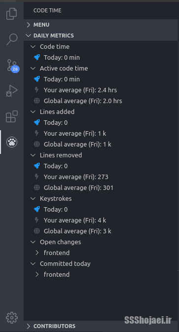

درود، شب و روز برتون خوش. توی قسمت قبل [[فری‌لنسری چیست؟ (۱) خون دل خوردن](/blog/freelancer-01)] درمورد مراحل قبل از پروژه گرفتن نکاتی رو بررسی کردیم. توی این قسمت درمورد قیمت‌گذاری و زمان بندی پروژه میگیم. چیزهایی که قبل از ارسال پیشنهاد برای پروژه نیازه درموردشون بدونیم.

## قیمت گذاری:

قیمت گذاری استاندارد خاصی نداره ولی نکاتی هست که باید درموردشون بدونیم تا بتونیم یه نرخ مناسب به کارفرما بدیم. یه داستان‌هایی درمورد  [پل صراط](https://fa.wikipedia.org/wiki/%D9%BE%D9%84_%D8%B5%D8%B1%D8%A7%D8%B7)  میگفتن برامون توی مدرسه سر زنگ هدیه‌های آسمانی…  
مرز نرخ دهی یه چیزی شبیه همون داستان هست. از مو باریک تر از شمشیر تیز تر و… ولی با این نکات امیدواریم که از این مرز رد بشیم به نهرهای جاری از عسل پروژه گرفتن برسیم 😉

## سطح پروژه:

فرض کنید دو تا پروژه می‌بینیم که عنوانشون مثل هم هست. هر دو نوشتن “**فروشگاه آنلاین لوازم آرایشی**” اما قیمت هاشون ممکنه اختلاف زیادی با هم دیگه داشته باشه. دلیل این اختلاف قیمت رو من بهش میگم سطح پروژه. من دوتا نمونه میذارم که لزوما هم واقعی نیستن ولی مشابه‌ش رو زیاد میشه پیدا کرد.

> پروژه‌ی اول:
> 
> پروژه طراحی فروشگاه اینترنتی محصولات آرایشی بهداشتی شامل چه جزئیاتی است:  
> قصد طراحی یک فروشگاه اینترنتی برای فروش محصولات آرایشی و بهداشتی داریم. میخواهیم سایت بسیار مدرن باشد. دارای درگاه پرداخت باشد و همچنین قابلیت های به روز فروشگاه های اینترنتی.

> پروژه‌ی دوم:
> 
> با سلام. ما نیاز به توسعه دهنده‌ای داریم که بتونه سایتی با امکانات زیر رو برای ما طراحی کنه.  
>   
> امکان لاگین با شماره موبایل  
> نمایش ریسپانسیو و سریع سبد کالا در گوشی موبایل و تبلت‌ها  
> -محاسبه‌گر هزینه ارسال  
> ارسال ایمیل از مراحل سفارش بدون خطا  
> امکان دانلود فایل رایگان برای اعضا و خریداری فایل پی‌دی اف  
> نصب کدهای مربوط به نماد اعتماد و …  
> اینتگریت کردن فروشگاه با بخش‌هایی از سایت آموزشی ما مثل ارائه‌ی دستورها و آموزش‌های ساخت مرتبط با کالاها در نوشته مخصوص هر کالا

پروژه‌هایی مثل دسته‌ی اول رو معمولا خود کارفرما هم دقیق نمیدونه چی میخواد. بیشتر این پروژه‌ها، پروژه‌های ارزونی هستند و به سرعت توی پیشنهادهای خیلی خیلی ارزون غوطه‌ور میشن. البته اگر وقت و حوصله‌ی کافی رو دارید و توی توجیه کردن آدم ها خوب هستید، حتما پیشهادتون رو بفرستید براشون. بعضی‌هاشون کاسب‌های پولداری هستند که اگر بتونید نظرشون رو جلب کنید و بهشون ثابت کنید بهترین چیز ممکن برای توسعه‌ی کسب‌وکارشون رو میسازید براشون و به خوبی درکشون میکنید، احتمال داره از یه پروژه ای که خیلی از حرفه‌ای ترها ازش میگذرن یه پروژه ی حرفه‌ای بسازید و درآمد خوبی هم به دست بیارید.

دسته‌ی دوم معمولا دردسر کمتری دارند، این دوستان خودشون میدونن چی میخوان شما می‌تونید باهاشون درمورد روش و تکنولوژی‌هایی که باهاش سایت رو پیاده میکنید گفت‌وگو کنید. بعضی از این دوستان گروه دوم حتی خودشون برای تکنولوژی‌ها پیشنهاد میدن توی توضیحات. مثلا میگن فرانت با ری‌اکت بهتره باشه و بک‌اند با لاراول مثلا.

**نکته‌ی کنکوری:**  بعضی‌ها هستند که یه صف طولانی از تکنولوژی‌هایی که میخوان توی سایت باشه لیست میکنن و هیچ کدوم هم ربط مشخصی به بقیه نداره. بدانید و به گوش باشید که اینا همون گروه اول هستند که میخوان گروه دوم به نظر بیان.

پس برای جمع بندی این مورد، اول بسنجید که سطح پروژه و کارفرما چطوریه. اگر فقط یه چیزی میخواد که کارکنه نمیتونید قیمتی که دوست دارید بهش بگید و معمولا باید سطح پروژه رو تا قیمت میانگین پایین بکشید (برای این مثال احتمالا از ۱ تا ۳ میلیون قیمت بدید میتونید پروژه رو بگیرید)  
برای گروه دوم که توضیحات دقیق‌تر یا حتی فنی میدن تلاش کنید چندتا پلن مختلف آماده کنید و بهشون پیشنهاد بدید. بگید اگر pwa طراحیش کنم این قدر خوبی داره براتون، اینقدر هزینه‌هاتون میره بالاتر و اینقدر بازدهیتون میره بالاتر و چندتا پیشنهاد پایین تر هم بهش بدید. حق انتخاب خیلی شانستون رو میبره بالا. (برای این مثال میشه از ۵ تا ۲۵ میلیون پلن‌های مختلف داد بهشون)

## زمان:

بازه‌ی زمانی هم تاثیر زیادی روی قیمت داره. پروژه اگر قراره توی ۱۴ روز انجام بشه با زمانی قراره توی ۶۰ روز انجام بشه قیمتش متفاوت میشه. من سر یه پروژه با دوستی کار میکردم که هر وقت ازش میپرسیدم چطور پیش میره کارها میگفت امشب میشینم پشتش تمام میشه. اون یه شب هیچ‌وقت نرسید! این مثال رو زدم که بگم اگر فکر میکنید پروژه‌ای براتون ۳ روز زمان میبره بگید ۱۰ روز. اگر پروژه رو یه هفته‌ای تحویل بدید طرف کلی هم ممنون میشه ازتون ولی اگر بگید ۳ روز، ۴ روزه تحویل بدیدم داستان میشه. خیلی وقت‌ها به یه چیز پیش‌بینی نشده ممکنه بخوره آدم. فری‌لنسری مثل کار ثابت نیست که بتونید مرخصی بگیرید یا درک کنن شرایط رو، خودتون باید اینا رو در نظر بگیرید توی زمان دادن.  
برای مدیریت دقیق و برنامه ریزی کارهاتون هم میتونم پیشنهاد کنم از  [Tasks](https://play.google.com/store/apps/details?id=org.tasks&hl=en_US)  استفاده کنید. نرم‌افزار آزاد مدیریت کارهاست و یکی از بهترین‌هاست.  
اگر برای اینکه حدس دقیق‌تری داشته باشید درمورد زمان پروژه بهتون، پیشنهاد میکنم  [Code Time](https://marketplace.visualstudio.com/items?itemName=softwaredotcom.swdc-vscode)  رو روی VSCode تون نصب کنید. اگر ادیتور دیگه‌ای دارید هم احتمالا میتونید مشابه این رو براش پیدا کنید.

این افزونه زمان کار کردنتون روی یه پروژه رو با جزئیات دقیق توضیح میده. مثلا میگه من روزی ۲.۴ ساعت به صورت میانگین روی این پروژه وقت میذاشتم که امروز هنوز سهمش صفر هست.

در نهایت برای جمع کردن موضوع این نوشته:

-   وقتی فری‌لنسر میشید، ۴۰٪ کار شما برنامه نویسی میشه و ۶۰٪ دیگه زمانتون رو باید برای حرف زدن با کارفرماهای مختلف و پیدا کردن پروژه‌ی خوب کنار بذارید. (برای کارفرما وقت بذاریم)
-   هم زمان و هم هزینه با توجه به تجربه‌ی شخصی به دست میاد ولی میتونید با جست‌وجو کردن پروژه‌های مشابه‌ش توی اینترنت میانگین زمان و هزینه رو دربیارید.
-   تلاش کنید لیست دقیقی از کارها درست کنید و مورد به مورد طبق همون پیش برید. اگر ۱۰۰ تا مورد توی لیستتون باشه و بگید روزی ۱۰ تاش رو میتونم انجام بدم، می‌دونید که پروژه ۱۰ روزه تمام میشه و می‌تونید به کارفرما پیشنهاد ۱۵ روز رو بدید.
-   موقع پیشنهاد هزینه علاوه بر جیب کارفرما به خودتون هم فکر کنید. نمیگم برای شروع خیلی درگیر این داستان بشید ولی خط فقر امسال (سال 99) به گزارش دوستان به ۷ میلیون رسیده. یعنی اگر کمتر از ۷ میلیون در ماه درمیاریم زیر خط فقر هستیم…

سپاس بابت همراهیتون  
شما هم تجربه‌هاتون درمورد قیمت و زمان گذاری رو با من و دوستان به اشتراک بذارید.