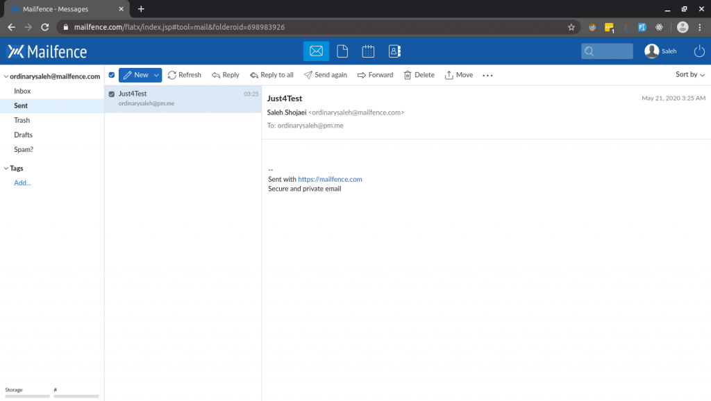
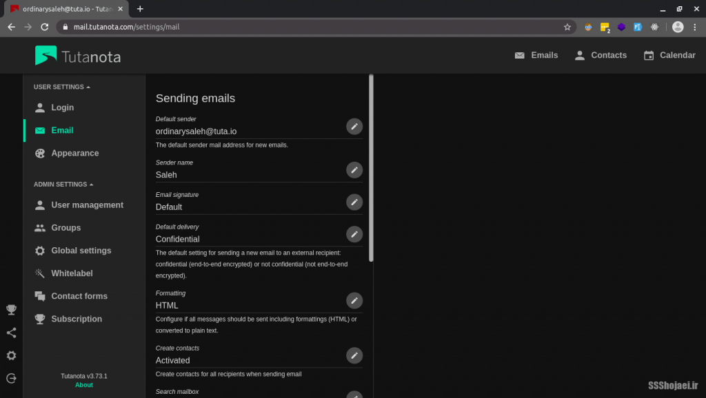
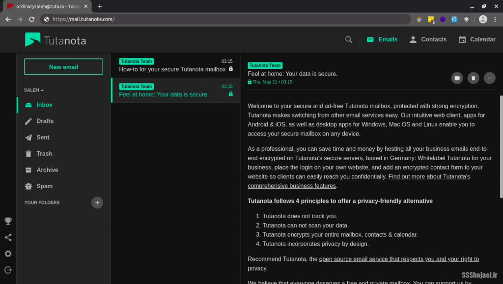
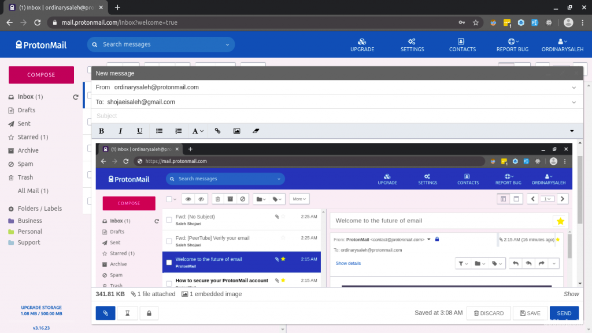
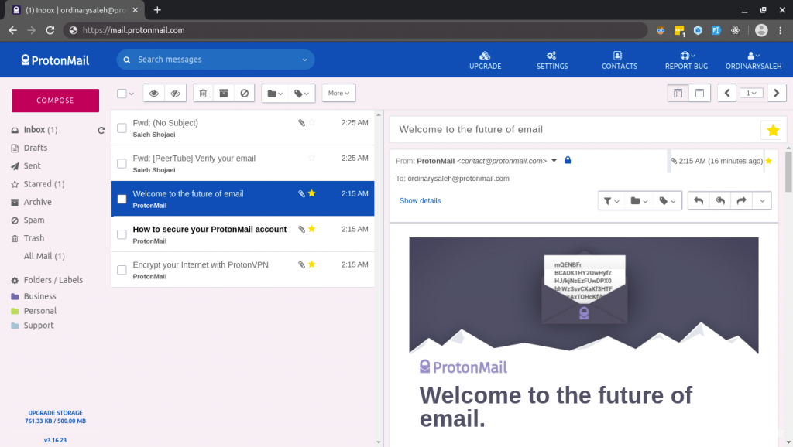

درود دوباره، شب و روز برتون خوش. توی قسمت پیش با هم چندتا از [جایگزین‌های خوب برای موتور جست‌وجوی گوگل](https://ssshojaei.ir/blog/post/google-alternatives/155) رو بررسی کردیم. توی این قسمت قرار هست درمورد جایگزین‌های سرویس ایمیل محبوب گوگل، Gmail صحبت کنیم. من خودم سال‌ها کاربر Gmail بودم و از استفاده کردن ازش لذت میبردم، اما گوگل خیلی بیشتر از چیزی که تصور کنیم داده‌های مختلف ما رو جمع میکنه و درمورد ما یاد میگیره. چند بار حس کردم نتایج جست‌وجوگر گوگل با توجه به ایمیل‌های یه سایت که برام فرستاده می‌شد عوض می‌شدن و این خیلی معنی داره…  
در هر صورت، بریم ببینیم چه در پیش داریم!

۳- [میل‌فنس (MailFence)](https://mailfence.com/)
------------------------------------------------

سرویس ساده و یه مقدار قدیمی ولی بی دردسر و دم دست

*   ظاهر نه چندان حرفه‌ای
*   **بازمتن**
*   **رمزنگاری پایان به پایان؟ (end-to-end encrypted)**
*   بدون قابلیت شخصی‌سازی
*   بدون انتخاب در دامین آدرس ایمیل
*   جداکردن خودکار هرزنامه‌ها

۲- [توتانوتا (Tutanota)](https://tutanota.com/)
-----------------------------------------------

زیبا، جادار، مطمئن

*   
    
*   
    

*   **بازمتن**
*   ظاهر خوب
*   **رمزنگاری پایان به پایان؟ (end-to-end encrypted)**
*   امکان ساخت پوشه و دسته‌بندی ایمیل‌ها
*   افزودن دامنه شخصی رایگان

۱- [پروتون‌میل (ProtonMail)](https://protonmail.com/)
-----------------------------------------------------

این سرویس ایمیل مورد علاقه‌ی من شده، امکانات و امنیت زیادی داره و ساده و دردسترس هست. یکی از ویژگی‌های جالبش اینه که می‌تونید بهش استایل css بدید! این یعنی بی‌اندازه تم مختلف میتونید براش پیدا کنید یا هرچیزی میخواید خودتون بنویسید و تغییر بدید توی ظاهرش  
[این ابزار خیلی کمک میکنه](https://scastiel.gitlab.io/protonmail-theme-creator/) (ProtonMail theme creator)

*   
    
*   
    

*   **بازمتن**
*   **رمزنگاری پایان به پایان؟ (end-to-end encrypted)**
*   **احرازهویت دومرحله‌ای**
*   **پوشه‌بندی و برچسب گذاری ایمیل‌ها**
*   فیلترهای پیشرفته برای حذف اسپم‌ها
*   امکان پاسخ خودکار (Automatic Reply)
*   ظاهر حرفه‌ای و امکان تنظیم پوسته دلخواه
*   چندکاربره بودن ایمیل (ایمیل شرکتی مثلا) با لاگ‌گیری از فعالیت‌هاشون
*   دامین زیبا و کوتاه **pm.me** یا (Private Message .me)
*   500 مگابایت فضای رایگان
*   برنامه‌ی خوش قیافه‌ی اندروید و IOS

خوشحال میشم تجربه‌هاتون درمورد سرویس‌هایی که معرفی شد و اونایی که نشد رو باهامون به اشتراک بذارید