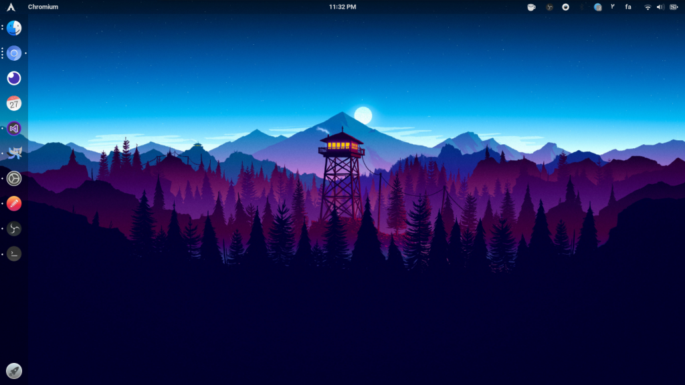
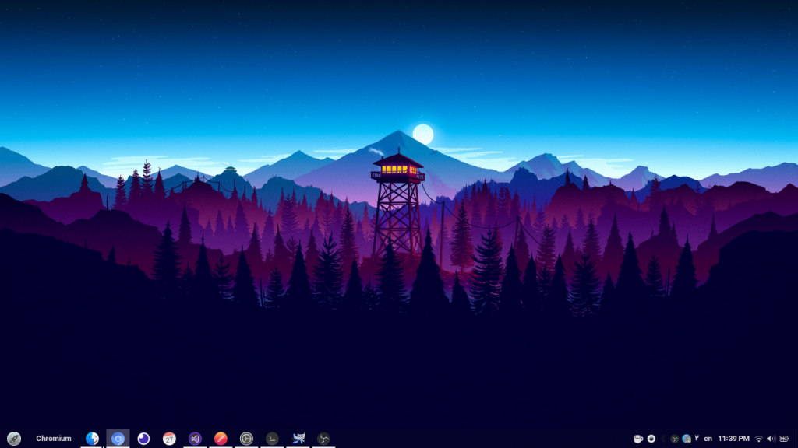
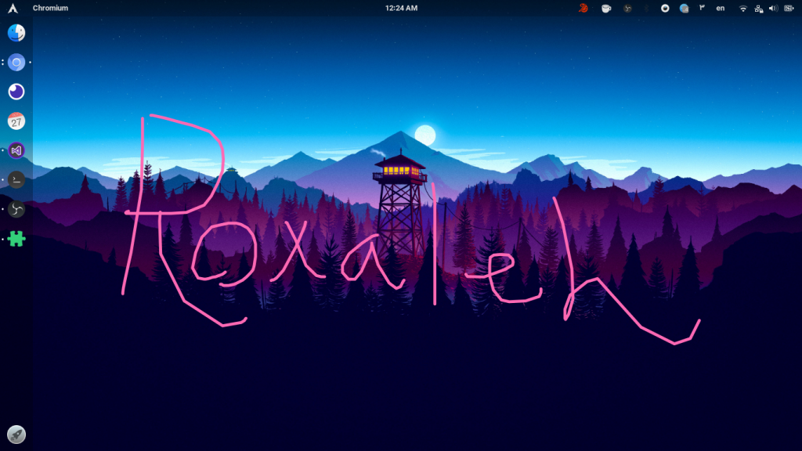

گنوم یکی از پر کاربرترین و خفن‌ترین دسکتاپ‌های دنیای گنو/لینوکس هست (البته خفن بودن رو خارج از دنیای گنو/لینوکس هم هست). یکی از دلیل‌های خفن بودنش هم افزونه‌هاش هستن. توی این نوشته من افزونه‌های مورد علاقه‌ی خودم رو باهاتون به اشتراک میذارم.

مواد لازم برای شروع کار:
------------------------

گنوم داشته باشید، ترجیحا ۳.۳۶ به بالا

    gnome-shell --version

بتونید افزونه‌های گنوم رو نصب کنید

    sudo apt install gnome-shell-extensions

همینطور افزونه‌ی مربوطه رو روی [فایرفاکس](https://addons.mozilla.org/en-US/firefox/addon/gnome-shell-integration/) یا [کروم/کرومیوم](https://chrome.google.com/webstore/detail/gnome-shell-integration/gphhapmejobijbbhgpjhcjognlahblep?hl=en) نصب کنید

معجزه‌ی افزایش قوای خفنیت! | Fly-Pie:
-------------------------------------

این افزونه یه منوی جذاب بهتون میده که میتونید باهاش هر کاری کنید، یه حالت یادگیری خودکار داره که یاد میگیره هی دسترسی رو براتون ساده تر میکنه. از کنترل موزیک تا باز کردن برنامه یا هر کار دیگه ای که بهش بسپارید رو فقط با زدن Ctrl + Space و کشیدن موس روی صفحه میتونید انجام بدید.

[نصب Fly-Pie](https://extensions.gnome.org/extension/3433/fly-pie/)

نخواب لعنتی | Caffeine:
-----------------------

کافئین یه آیکون به System Tray اضافه میکنه که باعث میشه سیستمتون sleep نشه، هر وقت بخواید میتونید خاموش و روشنش کنید راحت.

[نصب Caffeine](https://extensions.gnome.org/extension/517/caffeine/)

کرم جذاب‌کننده‌ی گنوم | Coverflow Alt-Tab:
------------------------------------------

وقت Alt + Tab رو بزنید میتونید به شکل خیلی زیبایی بین پنجره‌ها جا به جا بشید، چندتا حالت مختلف هم داره که میتونید هرجور دوست دارید تنظیمش کنید

[نصب **Coverflow Alt-Tab**](https://extensions.gnome.org/extension/97/coverflow-alt-tab/)

لنگر کشتی خفنیت | Dash to Dock:
-------------------------------

منوی سمت چپی که میبینید کار Dash to Dock هست، کلی تنظیمات خفن داره که حتما پیشنهاد میکنم انگلوکش کنید.

[نصب Dash to Dock](https://extensions.gnome.org/extension/307/dash-to-dock/)

اسپری افزایش کارایی | Dash to Panel:
------------------------------------

امکانات Dash to Panel خیلی زیاده و تقریبا هرچیزی برای داشتن یه پنل خوب نیاز دارید رو یه جا قلبمه توی خودش داره، من Dash to Dock رو بیشتر دوست دارم ولی اگر به ویندوز عادت دارید بهتون خیلی میچسبه احتمالا

[نصب Dash to Panel](https://extensions.gnome.org/extension/1160/dash-to-panel/)

خفن آینه‌ای | GSConnect:
------------------------

این بهتون امکان همگام کردن گوشی اندروید/ios تون رو با گنوم میده، کنترل موس و کیبورد و ارسال فایل و دیدن نوتیفیکیشن‌ها و… از کوچیک ترین‌هاش هست. توی یه ویدیو روی یوتیوب باهاش کاری کردیم بشه با گوشی دسکتاپمون رو لاک/آنلاک کنیم.

[نصب GSConnect](https://extensions.gnome.org/extension/1319/gsconnect/)

افسا… صبر کن براش …نه‌ای | Persian Calendar:
--------------------------------------------

بهترین تقویم خورشیدی‌ای هست که دیدم، تمام مناسبت‌های باستانی و جهانی هم داره، همینطور رسمی ایران و مذهبی‌ها رو اگر بخواید فعال کنید و اینگونه میشه که پر از جشن‌های جالب هست داخلش هر موقع به دسکتاپم نگاه میکنم. امکانات دیگه‌ای هم داره که نصبش کنید باهاش آشنا میشید.

یه نکته‌ای رو بگم ولی، من از زیر خطی که روزهای مناسبت‌دار دارن خوشم نمیاد زیاد، راحت میتونید هرجور دوست دارید دستکاری کنید این تقویم رو.

    gedit ~/.local/share/gnome-shell/extensions/PersianCalendar@oxygenws.com/stylesheet.css
    
    # replace "underline" with "none"
    .pcalendar-holiday, .pcalendar-day-with-events {
        text-decoration: underline;
    }

[نصب Persian Calendar](https://extensions.gnome.org/extension/240/persian-calendar/)

کرم شفاف کردن پوست‌ه | Transparent Topbar:
------------------------------------------

این افزونه کمک میکنه منو‌ی بالا رو شفاف کنید، اگر از میزان شفافیتش راضی نبودید اینطوری میتونید شفافیتش رو عوض کنید.

    gedit ~/.local/share/gnome-shell/extensions/TransparentTopbar@enrico.sorio.net/stylesheet.css
    ## replace "0.5"
    .panel-transparency {
        background-color: rgba(0, 0, 0, 0.5);
    }

[نصب Transparent Topbar](https://extensions.gnome.org/extension/240/persian-calendar/)

پوسته رو بشکن | Pop Shell:
--------------------------

پاپ‌شل هم بسیار خفن تشریف دارن، درموردش توی یه پست و ویدیوی جدا از پیش توضیح دادم.  
[https://roxaleh.ir/blog/post/pop-shell](https://roxaleh.ir/blog/post/pop-shell)

[نصب Pop Shell](https://github.com/pop-os/shell#installation)

قلم خفن نویس | Draw On You Screen:
----------------------------------

از اینا رو احتمالا توی آموزش‌ها خفن [جادی](https://jadi.net) دیدید، باهاش میشه روی اسکرین نوشت، قابلیت های خیلی خوبی هم داره که اگر خط خوبی ندارید مثل من خیلی به کارتون نمیاد. با Super + Alt + D می‌تونید بنویسید روی صفحه، با Super + Alt + E هم نوشته‌ها رو پاک میکنه کلا و با Esc هم میاد بیرون، کاملش رو میتونید ببینید توی صفحه‌ی خودش

[نصب Draw On You Screen](https://extensions.gnome.org/extension/1683/draw-on-you-screen/)

اینا بود لیست افزونه‌های من، شما هم افزونه های کاربردیتون رو به من معرفی کنید ❤️