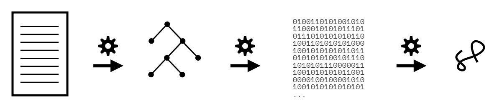
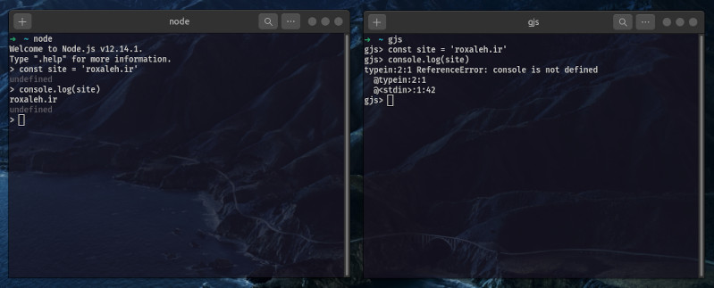
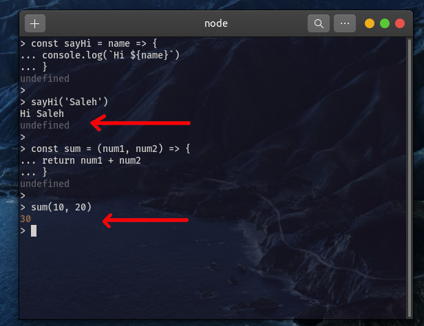

جاوااسکریپت یکی از محبوب‌ترین زبان‌های برنامه نویسی دوران ما هست

خیلی‌هامون توسعه‌دهنده‌ی javascript هستیم اما نمیدونیم چطوری کار میکنه. توی این نوشته به ساده ترین شکلی که میتونم تلاش میکنم چیزی که این مدت درمورد Runtime environment مرورگرها فهمیدم رو براتون بازگو کنم.

## کامپایلری یا مفسری؟

جااسکریپت مفسری هست یا کامپایلری؟ خوب چیزی که خیلی‌هامون فکر میکنیم اینه که اسکریپتی و مفسری هست اما حقیقت یه مقدار پیچیده تر هست.
پیش از اینکه دقیق تر بررسی کنیم بهتون میگم که **پاسخ هیچ کدوم نیست اما به کامپایلری نزدیک‌تر هست**!

راز این داستان داخل نوع رفتار جاوااسکریپت با خطاها هست. زبان‌های اسکریپتی معمولاً از بالا به پایین، خط به خط اجرا میشن. این یعنی اگر خط ۵ برنامه خطایی داشته باشه، تا وقتی خط ۱ تا ۴ اجرا نشن متوجه خطا نمیشیم. اما جاوااسکریپت قبل از اجرا شدن یک بار parse میشه و خطاهاش مشخص میشه.



این روندی هست که یک برنامه‌ی مدرن جاوااسکریپتی طی میکنه تا اجرا بشه

1. با babel ترنسپایل میشه به JS با پشتیبانی توی مرورگرهای قدیمی

2. با webpack بسته بندی میشه

3. انجین JS کد رو parse میکنه و درخت طیبه‌ی AST (Abstract Syntax Tree) رو میسازه

4. انجین جاوااسکریپت AST رو به فایل واسط باینری تبدیل میکنه و اون فایل توسط JIT (Just In Time) تبدیل و بهینه میشه.

5. و در آخر ماشین مجازی JS رو اجرا میکنه

   (درمورد اتفاق هایی که داخل ۳ قدم آخر افتادن پایین تر کامل توضیح میدم بهتون)

همونطوری که میبینیم این فرایند به کامپایلیری بودن خیلی نزدیک تر هست یا مفسری بودن.


## یه مرورگر چطوری فایل JS رو اجرا میکنه؟

هر مرورگری (کروم، فایرفاکس، سافاری و...)، یک بخش برای اجرای جاوااسکریپت داره که یک‌سری API رو در اختیار توسعه‌دهنده ها قرار میده؛ چیزهایی مثل DOM, setTimeOut, fetch و...
این APIها جدا از خود جاوااسکریپت هستن و متودهایی هستن که مرورگر در محیط اجرای جاوااسکریپت خودش در کنار انجین اصلی JS قرار میده.




شاید تعجب کنید که console و window هم جز جاوااسکریپت نیستن و توی Runtime environment ها به عنوان API اضافه میشن. بنابر این انجین جاوااسکریپت بخشی از محیط اجرای جاوااسکریپت هست. بیاید نگاهی به موتورهای معروف اجرای جاوااسکریپت بندازیم.

- [انجین V8](https://github.com/v8/v8) - توسط گوگل توسعه داده میشه برای کروم و آزاد هست - با C++ نوشته شده
- [انجین SpiderMonkey](https://github.com/mozilla-spidermonkey) - توسط فایرفاکس توسعه داده میشه - اولین موتور اجرای جاوااسکریپت بوده - آزاد هست و با C, C++ و Rust نوشته شده
- [انجین JavascriptCore](https://github.com/WebKit/WebKit) - توسط اپل و ادوبی توسعه داده میشه - با C++ نوشته شده و آزاد هست
- انجین Chakra - توسط مایکروسافت برای اینترنت اکسپلورر توسعه داده می‌شد
- [انجین  Chakra](https://github.com/chakra-core/ChakraCore) - این سری برای Edge توسعه داده میشه
- [انجین JerryScript](https://github.com/jerryscript-project/jerryscript) - برای اینترنت چیزها استفاده میشه و بسیار سبک هست - با C99 نوشته شده و آزاد هست

## محیط اجرایی جاوااسکریپت (Javascript Runtime Environment)

این محیط رو مثل یک جعبه یا دربرگیرنده (Container) تصور کنید. جعبه‌ای که داخلش چندتا جعبه‌ی کوچیک تر و مستقل از هم قرار دارن. وقتی انجین جاوااسکریپت شروع به کار کنه، هر بخش از کد با توجه به کارکردش داخل یکی از این جعبه‌ها قرار میگیره.


این تصویر به درک بهتر روند اجرا کمک بسیاری میکنه، بخش‌های مختلفش رو با هم بررسی میکنیم.

## Heap Stack (پشته‌ی حافظه)

این بخش از انجین اصلی جاوااسکریپت هست. زمانی که انجین به متغییرها و تعریف فانکشن‌ها میرسه، اون‌ها رو اینجا ذخیره میکنه تا بعداً زمانی که بهشون نیاز پیدا کرد ازشون استفاده کنه

## Call Stack (پشته‌ی اجرایی)

این بخش هم از انجین اصلی جاوااسکریپت هست، زمانی که کد به بخش‌های اجرایی میرسه اون‌ها رو اینجا لیست میکنه تا اجرا بشن. وقتی یک فانکشن داخل Stack لیست میشه، جاوااسکریپت به سرعت شروع به تجزیه‌ی کد میکنه، متغییرهاش رو از ‌Heap فراخونی میکنه و اگر فانکشن یا متغییر تازه‌ای نیاز داشته باشه اون رو به بالای لیست اضافه میکنه. شاید (با توجه به نوع فانکشن)، اون رو به جعبه‌ی WebAPI بفرسته تا مرورگر مسئولیتش رو به گردن بگیره.

وقتی فانکشن مقداری رو return کنه یا به جعبه‌ی WebAPI ارسال بشه، از لیست استک حذف میشه تا فانکشن بعدی جاش رو بگیره.
اگر انجین جاوااسکریپت یک فانکشن رو کامل حل کنه اما پاسخی return نشه، انجین به صورت پیشفرض مقدار undefined رو برمیگردونه و تابع رو از لیست اجرایی حذف میکنه.



همین تک به تک پردازش فانکشن‌ها هست که جاوااسکریپت رو به Syncronous (تک خطی) بودن معروف کرده. جاوااسکریپت در هر لحظه تنها یک کار رو انجام میده.

نکته: ساختار داده داخل Call Stack به صورت Last In, First Out (LIFO) هست. یعنی آخرین چیزی که اضافه شده، اولین چیزی هست که حل میشه. مثل کوله‌ای در نظر بگیرید که آخرین چیزی که داخلش گذاشتید. اولین چیزی هست که میتونید ازش بردارید. در نتیجه به جز آخرین تابع وارد شده چیزی اجرا نمیشه مگر اینکه حل بشه یا به WebAPI سپرده بشه و از لیست حذف بشه.

## WebAPI

وقتی که انجین جاوااسکریپت به فانکشن‌ها یا توابعی مثل event listenerها و http request ها و یا در کل فانکشن‌هایی که در زمان خاصی اعمال میشن میرسه، اون‌ها رو به اینجا میفرسته تا در زمان مناسب مرورگر بهش یادآوری کنه. مثلاً فانکشنی که به رویداد OnClick وصل شده یا ریکوئستی که به منبع خارجی فرستاده میشه. در این جور مواقع callback function اون‌ها به callback queue فرستاده میشه.

دلیل این روش هم کارآمد کردن جاوااسکریپت هست، اگر وقتی یک درخواست میفرسته تا نتیجه بیاد یا وقتی یک فانکشن شمارنده مشغول شمردن هست کل صفحه freeze بشه، قطعا وب به اندازه‌ی فعلی جذاب نخواهد بود. وقتی چنین شرایطی پیش میاد، اون ها رو از لیست اجرا (Call Stack) حذف میکنه و به سراغ کار بعدی میره، نتیجه که آماده شد به لیست انتظار میرسه و دوباره وارد Call Stack میشه.

## Callback Queue

توی این صف تمام callback functionها از سمت WebAPI داخل صف قرار میگیرن. نکته‌ی مهم اینه که **این فانکشن‌ها باید تا زمان خالی شدن  Call Stack صبر کنن**. وقتی که پشته‌ی اجرایی کاملا خالی شد، این توابع برای اجرا شدن به اونجا اضافه میشن.
نکته‌ی مهم: ساختار داده‌ای این قسمت First In, First Out (FIFO) هست، مثل صف نونوایی که کسی که اول بیاد، اول هم میره. داخل این استک از متد push (اضافه کردن به آخر) و shift (حذف از اول) استفاده میشه.

## Event Loop (حلقه‌ی رویداد)

کار این بخش این هست که به شکل مداوم callback queue و call stack رو بررسی میکنه تا ببینه کی اون لیست خالی میشه یا آیا فانکشنی توی صف هست یا نه.

شاید زمان‌هایی باشند که callback queue و call stack هر دو خالی باشند، ولی EL (Event Loop) هرگز غیر فعال نمیشه و همیشه در حال بررسی این دو بخش هست. زمانی که اولین فانکشن به صف انتظار از سمت مرورگر وارد بشه، EL خیلی سریع Call Stack رو چک میکنه و اگر خالی بود، فانکشن رو به اونجا منتقل میکنه.

وقتی میگن جاوااسکریپت به صورت async یا غیر خطی اجرا میشه منظور همینه، در واقع به شکل تکنیکی این حرف درست نیست، به نظر میاد که جاوااسکریپت داره هم‌زمان چند وظیفه رو دنبال میکنه اما در واقعیت جاوااسکریپت تنها روی بالاترین وظیفه داخل لیست Call Stack کار میکنه.

## مرا کدی نشان ده!

```javascript
setTimeout(() => {
  console.log('Hey, why am I last?')
}, 0)

const sayHi = () => {
  console.log('Hello')
}

const sayBye = () => {
  console.log('Goodbye')
}

sayHi()
sayBye()
```

خوب خروجی این کد چنین است

```
Hello
Goodbye
Hey, why am I last?
```

با اینکه زمان انتظار setTimeOut صفر هست و پیش از همه نوشته شده اما پس از همه اجرا شده. بیاید ببینیم داخل انجین V8 چه مراحلی اتفاق افتاده.

1. انجین یک بار کل کد رو بررسی کرده تا ببینه خطای سینتکسی داریم یا نه. خطایی نبوده پس شروع به تجزیه‌ی کد کرده
2. انجین اولین فانکشن رو به call Stack منتقل کرده
3. توی این مرحله به setTimeOut رسیده که جزئی از متدهای WebAPI هست، در نتیجه اون رو به لیست WebAPI میفرسته و از لیست callStack حذف میشه.
4. به دلیل اینکه زمان تاخیر 0 هست، WebAPI در لحظه اون رو به Callback Queue میفرسته
5. توی این مرحله Event Loop میبینه که فانکشنی برای اجرا به صف اضافه شده، Call Stack رو چک میکنه تا ببینه اگر خالیه اون صف رو به اونجا منتقل کنه، اما call Stack خالی نیست چون در حال اجرای تابع sayHi و sayBye هست.
6. در اولین لحظه‌ای که setTimeOut از call Stack حذف شد، انجین به فانکشن‌های بعدی میرسه و اون‌ها رو داخل Heap ذخیره میکنه
7. حالا به فراخوانی فانکشن sayHi میرسه اون رو به call Stack اضافه میکنه.
8. فانکشن sayHi متود console.log رو صدا میزنه و اون به بالای call stack اضافه میشه.
9. انجین سریع به سراغ console.log میره، مقدار Hello رو داخل کنسول پرینت میکنه و console.log رو از لیست خارج میکنه.
10. دوباره به فانکشن sayHi برمیگرده و میبینه چیز دیگه‌ای برای انجام دادن نیست، مقدار پیش‌فرض undefined رو برمیگردونه و فانکشن رو از callStack حذف میکنه
11. همین مراحل برای sayBye هم اتفاق می‌افته
12. حلقه‌ی رویداد (Event Loop) وقتی میبینه صف خالی شد، صف رو به callStack منتقل میکنه و سرانجام Hey, why am I last? داخل کنسول چاپ میشه.

میتونید این روند رو از [این سایت](http://latentflip.com/loupe/?code=Ly8gZmlyc3QsIGNhbGwgdGltZW91dCBmdW5jdGlvbiwgc2V0IHRvIHplcm8gc2Vjb25kcwpzZXRUaW1lb3V0KGZ1bmN0aW9uKCl7CiAgY29uc29sZS5sb2coJ0hleSwgd2h5IGFtIEkgbGFzdD8nKTsKfSwgMCk7Ci8vIGRlY2xhcmUgdHdvIGZ1bmN0aW9ucwpmdW5jdGlvbiBzYXlIaSgpewogIGNvbnNvbGUubG9nKCdIZWxsbycpOwp9CmZ1bmN0aW9uIHNheUJ5ZSgpewogIGNvbnNvbGUubG9nKCdHb29kYnllJyk7Cn0KLy8gY2FsbCB0aGUgdHdvIGZ1bmN0aW9ucyBsYXN0CnNheUhpKCk7CnNheUJ5ZSgpOw%3D%3D!!!PGJ1dHRvbj5DbGljayBtZSE8L2J1dHRvbj4%3D) به صورت آهسته و تصویری گام به گام ببینید.


سپاس بابت اینکه تا اینجا خوندید نوشته رو، دیدگاه هاتون رو باهام درمیون بذارید، کلی بهم روحیه میده.

### منابع:

https://blog.sessionstack.com/how-javascript-works-inside-the-v8-engine-5-tips-on-how-to-write-optimized-code-ac089e62b12e
https://github.com/getify/You-Dont-Know-JS/blob/2nd-ed/get-started/ch1.md
https://www.javascripttutorial.net/javascript-event-loop/
https://dzone.com/articles/memory-management-and-garbage-collection-in-javasc
https://virgool.io/@shxhryar/javascript-runtime-environment-cad9snkl9syj
https://medium.com/@debbie.obrien/understanding-how-javascript-works-2ed11185e234
https://betterprogramming.pub/how-javascript-works-1706b9b66c4d
www.nodesimplified.com/2017/07/javascript-top-javascript-tips-and.html

و سایر چیزهایی که خوندم و یاد نیست...

برای دیدن و ارسال دیدگاه‌ها انگار نیاز به فیل‌تر شی‌کَن دارید 💔 