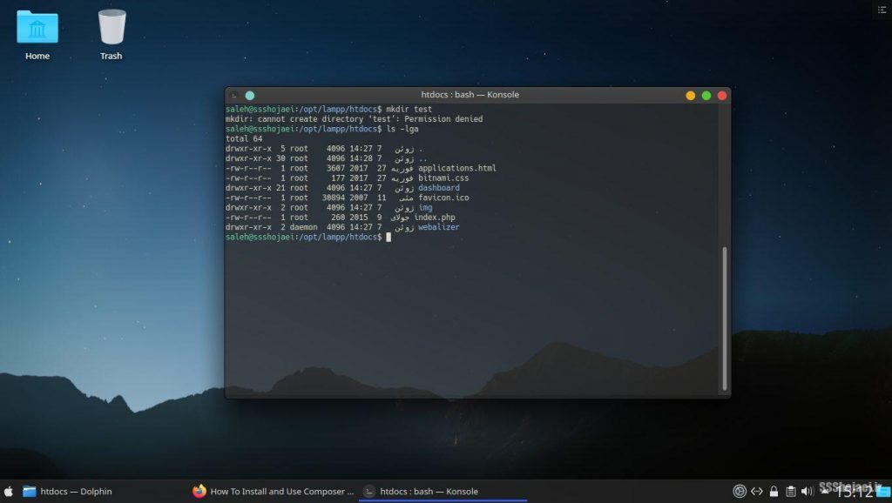
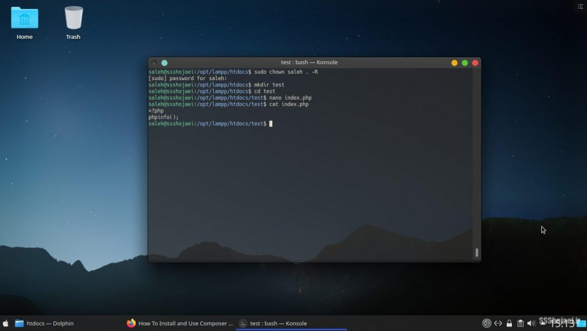
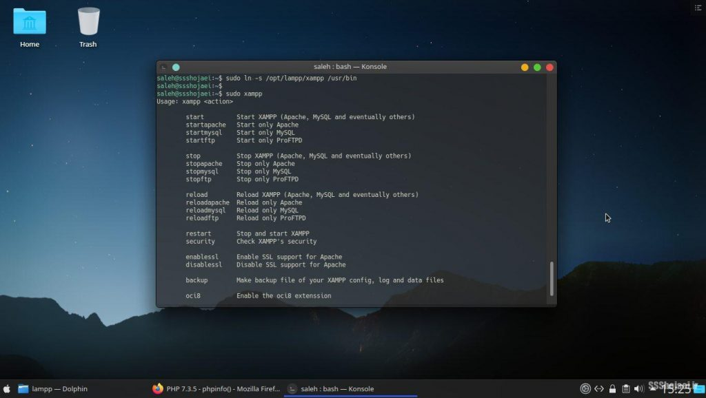

نصب و کانفیگ php, apache, mysql, phpmyadmin و سایر چیزایی که برای توسعه ی وب نیاز هست کار دشواریه و معمولا پیکربندی درست ابزارهای لازم خودش نیاز به دانش راه اندازی سرور داره که تخصصی جدا از برنامه نویس وب هست. برنامه‌هایی مثل xampp تمام این بسته‌ها رو یک جا جمع میکنن و با کانفیگ مناسبی بهمون ارائه میدن که خیلی خوبه اما مشکلاتی داره، مثلا نمیتونیم از فریم‌ورک‌هایی مثل لاراول یا مدیر بسته‌ی معروف composer استفاده کنیم. توی این پست میخوایم به سادگی زمپ رو نصب و به نحوی تنظیم کنیم که هیچ کدوم از این محدودیت‌ها رو نداشته باشیم.

از صفحه‌ی “**[آپاچی و دوستان](https://www.apachefriends.org/download.html)**“، بسته‌ی زمپ مورد نظرتون رو دانلود کنید. اگر نیاز به نسخه‌ی خاصی از php یا mysql دارید میتونید انتخاب کنید، پیشنهاد میکنم اگر حساس نیست براتون حتما آخرین نسخه رو دانلود کنید. (به سیستم عامل دقت کنید، برای ویندوز و مک و گنو/لینوکس نسخه‌های مختلفی داره)

پوشه‌ای که فایل دانلود شده داخلش هست رو باز کنید با ترمینال

نیاز هست که به فایل دسترسی اجرا شدن بدید تا بشه نصبش کرد

    chmod +x xampp-linux*.run

حالا فایل نصابش رو باز میکنیم

    sudo ./xampp-linux*.run

تا پایان فقط next رو بزنید تا نصب تمام بشه.

حالا از تب Manage Servers می‌تونید سرویس‌هایی که می‌خواید رو فعال کنید. تا اینجا ما تمام ابزارهای lampp رو نصب و راه اندازی کردیم! بریم امتحانش کنیم

مسیر پوشه‌ی پروژه‌های شما **” /opt/lampp/htdocs “** هست اما شما دسترسی درست کردن فایل و پوشه رو داخلش ندارید! برای اینکه این مشکل رو حل کنید، وارد همین پوشه توی ترمینال بشید و دستور زیر رو بزنید.

    sudo chown $USER . -R

حالا می‌تونید پروژه‌هاتون رو به اینجا کپی کنید یا پروژه‌ی تازه بسازید. مثلا من یه پوشه‌ی test میسازم تا ببینم پی‌اچ‌پی کار میکنه یا نه.

    mkdir test
    cd test
    echo '<?php \n phpinfo(); \n' > index.php

حالا اگر وارد [localhost/test](http://localhost/test) (به جای تست اسم پوشه‌ی خودتون رو بزنید) بشید، یه همچنین چیزی میبینید، یا با رفتن به [localhost/phpmyadmin](http://localhost/phpmyadmin)، پی‌اچ‌پی‌مای‌ادمین رو می‌بینید

خوب تا الان همه چیز خوب هست و درست کار میکنه، اما اگر بخوایم با لاراول یا کامپوزر و… کار کنیم چطور؟ توی ترمینال این دستور رو بزنید

    php --version

خوب همونطور که میبینید ما توی کل سیستم به php و سایر برنامه‌های بسته‌ی زمپ دسترسی نداریم و انگار اصلا نصب نشدن. پس بیاید این مشکل رو هم حل کنیم!

اگر به مسیر **” /opt/lampp/bin “** برید و ls رو بزنید، میبینید تمام این برنامه‌ها نصب هستن، همون دستور

    ./php --version

اینجا کار میکنه، تنها کاری که باید بکنیم این هست که این پوشه رو به “مسیرها” اضافه کنیم. اگر از bash استفاده میکنید bashrc. و اگر از zsh استفاده می‌کنید zshrc. توی مسیر ~ (خانه) شما هستش که باید به آخرش این رو اضافه کنیم.

    nano ~/.bashrc
    ### nano ~/.zshrc
    ### این رو اضافه میکنیم به آخرش
    export PATH=$PATH:/opt/lampp/bin

با ctrl + x و زدن y میتونید فایل رو ذخیره کنید و خارج بشید. حالا اگه یه بار ترمینال رو ببندید و دوباره باز کنید، به php و تمام ابزارهای دیگه دسترسی دارید و میتونید از لاراول و کامپوزر و هر چیز دیگه‌ای به سادگی استفاده کنید

همه چیز خوبه و دیگه کار خاصی نیست برای انجام دادن به جز این!

    sudo ln -s /opt/lampp/xampp /usr/bin

با این کار به خود برنامه‌ی زمپ از طریق ترمینال دسترسی دارید و میتونید با چیزهایی مثل sudo xampp start و sudo xampp stop سرویس هاش رو روشن و خاموش کنید

امیدوارم که مفید بوده باشه، پیروز باشید 💗