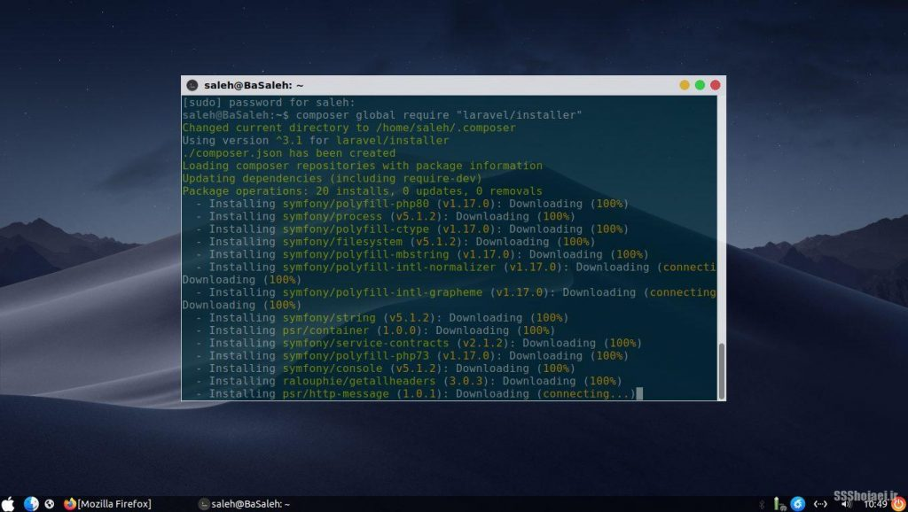
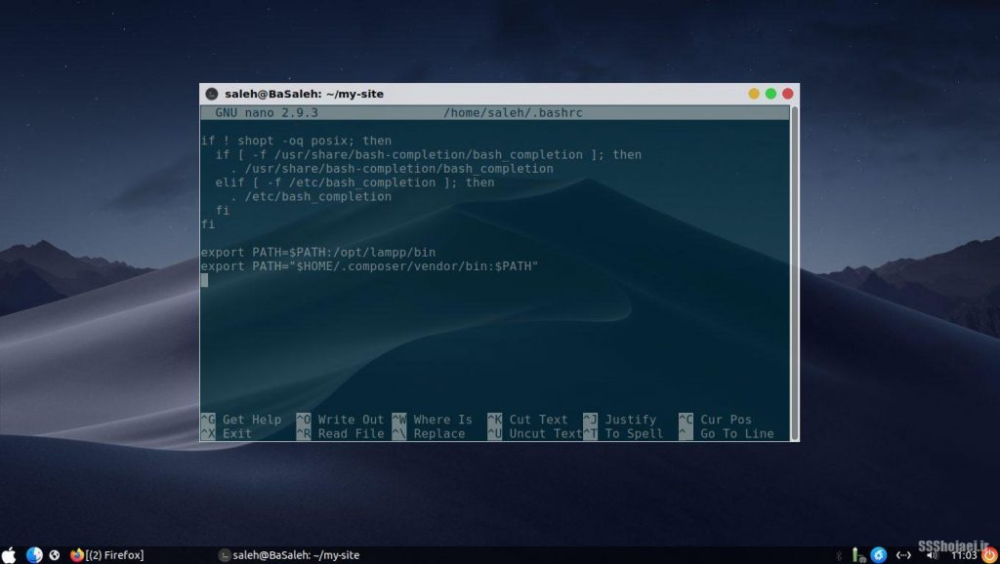
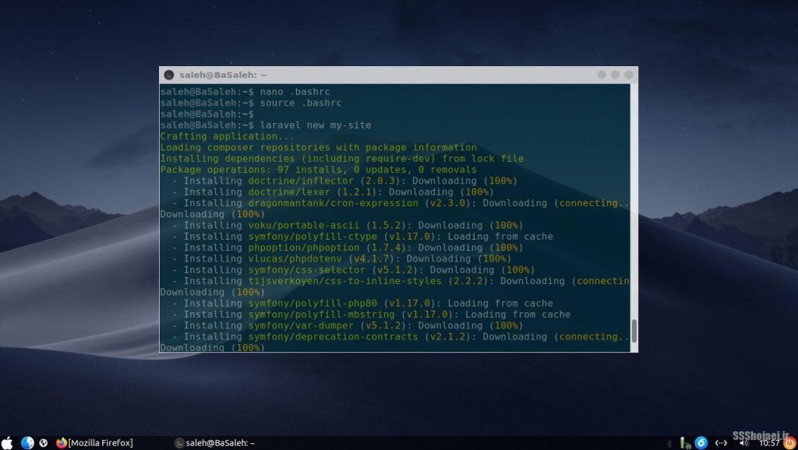
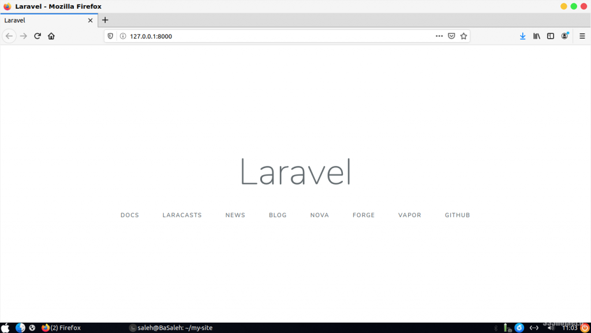
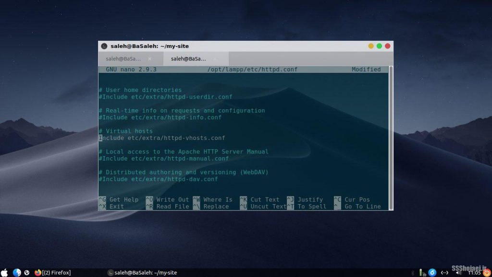
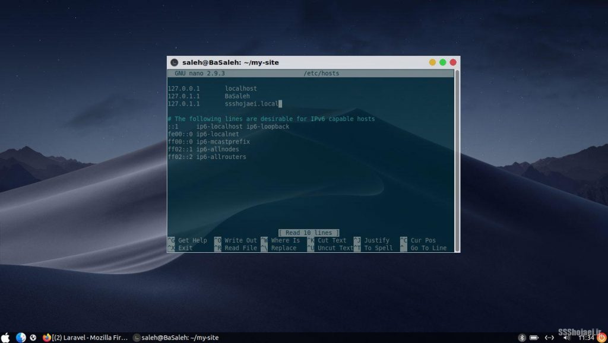
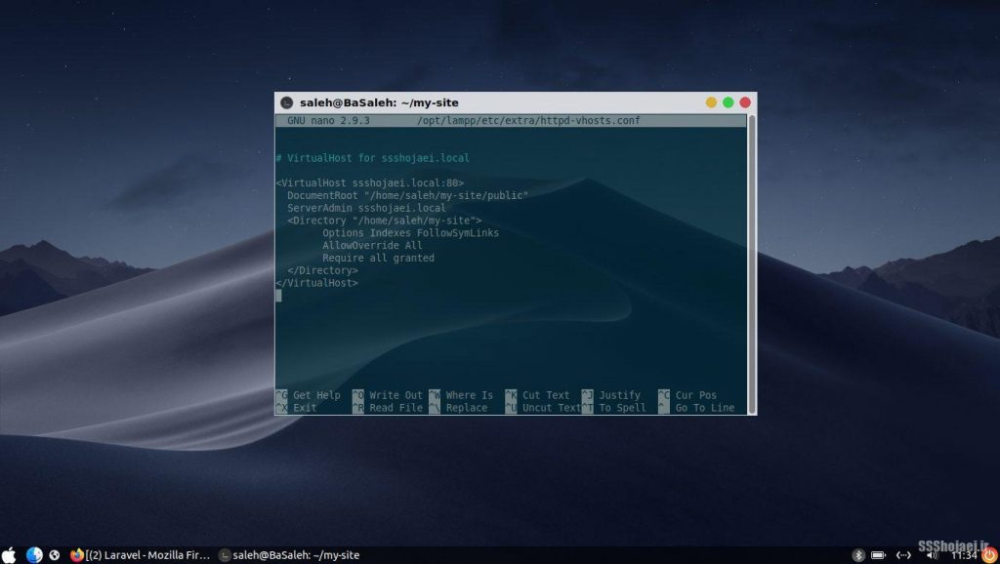
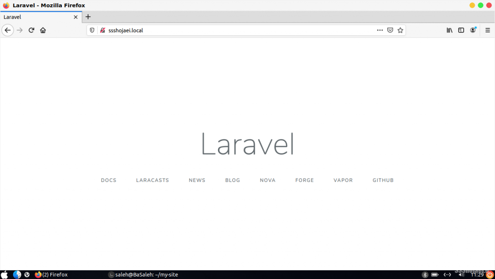

لاراول یکی از محبوب‌ترین فریم‌ورک‌های php و همینطور یکی از بهترین گزینه‌ها برای بک‌اند هست از دید من. راه انداختنش ممکنه یه کم دردسر داشته باشه ولی اینجا سریع ترین راه برای شروع کار باهاش رو پیش میریم و کار رو باهاش شروع میکنیم.

توی اولین قدم شما باید lampp رو داشته باشید که توی نوشته‌های پیش‌تر بهش پرداختیم. ([**نصب و راه‌اندازی xampp روی لینوکس**](/blog/install-config-lampp))

    sudo ln -s /opt/lampp/bin/php /usr/bin

با این کار برنامه‌ی php رو میذاریم جایی که کاربر روت هم بهش دسترسی داشته باشه

    curl -sS https://getcomposer.org/installer | sudo php -- --install-dir=/usr/local/bin --filename=composer

کامپوزر پکیج منیجر معروف دنیای php هست که از طریقش میتونیم لاراول و پکیج‌های مورد نیازش رو نصب کنیم

برای اینکه از نصب مطمئن بشید میتونید این رو بزنید

    composer --version

حالا می‌تونیم لاراول رو به صورت سراسری نصب کنیم

    sudo chown $USER ~/.composer/ -R
    ## تغییر دسترسی پوشه‌ی کامپوزر به یوزر فعلی به جای روت (برای سادگی استفاده)
    composer global require "laravel/installer"

الان نصب لاراول تمام شده اما اگر توی ترمینال بخواید از laravel استفاده کنید پیداش نمیکنه، باید نصب پکیج‌های کامپوزر رو اضافه کنید به مسیرهاتون، به آخر فایل کانفیگ شل‌تون این رو اضافه کنید

    nano ~/.bashrc
    # اگر از zsh یا شل دیگه‌ای استفاده میکنید فایل rc همون رو باید ویرایش کنید
    export PATH="$HOME/.composer/vendor/bin:$PATH"
    source ~/.bashrc

پ.ن: با زدن ctrl + o ذخیره و با ctrl + x میتونید خارج بشید

حالا که به لاراول دسترسی داریم می‌تونیم پروژه‌هامون رو بسازیم.

    laravel new my-site
    ## به جای my-site اسم پروژه‌ی خودتون رو می‌تونید بذارید
    cd my-site
    sudo chmod -R 777 storage
    sudo chmod -R 777 bootstrap/cache

    php artisan serve

حالا با رفتن به [127.0.0.1:8000](http://127.0.0.1:8000) می‌تونید سایت تازتون رو ببینید. تا اینجا ما به چیزی که می‌خواستیم رسیدیم، از اینجا به بعد اختیاری هست

استفاده از virtual host ها با لاراول خیلی چیز رایجی هست، با این روش می‌تونید به جای ای‌پی لوکال‌تون از یه اسم دامین مجازی استفاده کنید برای پروژه‌هاتون، مثلا mysite.local به جای ای‌پی بالا. بریم ببینیم چه در پیش هست.

    sudo nano /opt/lampp/etc/httpd.conf
    Include etc/extra/httpd-vhosts.conf
    ## هاست مجازی رو فعال کنید (# اول این خط رو حذف کنید)

با ctrl + w می‌تونید توی فایل دنبالش بگردید و بعدش # اولش رو حذف کنید تا “آن‌کامنت” بشه یا از کامنت بودن در بیاد و فعال بشه.

    sudo nano /etc/hosts
    127.0.0.1   mysite.local

این فایل رو با ویرایشگر باز کنید و مثل تصویر یه ردیف اینطوری درست کنید، بعد از 127.0.0.1 یه بار تب بزنید بعد اسم دامنه‌ای که می‌خواید رو بنویسید. هرچیزی می‌تونه باشه ولی استانداردش .local هست.

    sudo nano /opt/lampp/etc/extra/httpd-vhosts.conf

    <VirtualHost ssshojaei.local:80>
      DocumentRoot "/home/saleh/my-site/public"
      ServerAdmin ssshojaei.local
      <Directory "/home/saleh/my-site">
            Options Indexes FollowSymLinks
            AllowOverride All
            Require all granted
      </Directory>
    </VirtualHost>

فایل کانفیگ هاست مجازی رو باز کنید، چیزایی که پیش‌فرض داخلش هست رو پاک کنید (با نگهداشتن ctrl + k، خط به خط تا آخر پاک میشه). مثال پیش فرض خودش هست که خیلی به کار ما نمیاد، و این کد بالا رو داخلش بذارید.

- توی خط اول کد، به جای ssshojaei.local، اسمی که توی فایل قبلی گذاشتید رو استفاده کنید.
- توی خط دوم هم مسیر جایی که پروژه‌ی لاراولی‌تون هست رو بذارید به اضافه‌ی /public  
  /your/project/path**/public**  
  (می‌تونید با زدن pwd توی ترمینالی که داشتید مسیر پروژه رو ببینید)
- توی خط سوم هم دوباره دامینی که گذاشتید رو جایگزین ssshojaei.local کنید
- توی خط چهارم هم مثل دوم مسیر پروژه‌ی خودتون رو بذارید

حالا فایل رو ذخیره کنید و زمپ رو ری‌استارت کنید

    sudo xampp restart

اگر آدرس دامنه رو توی مرورگرتون بزنید، می‌بینید که کار میکنه و همه چیز خوب پیش رفته

می‌تونید افزونه‌های خوب vscode برای لاراول و php رو هم از این پست بخونید ([**افزونه های کاربردی VSCode برای فول‌استک‌ها**](/post/vscode-extensions))
