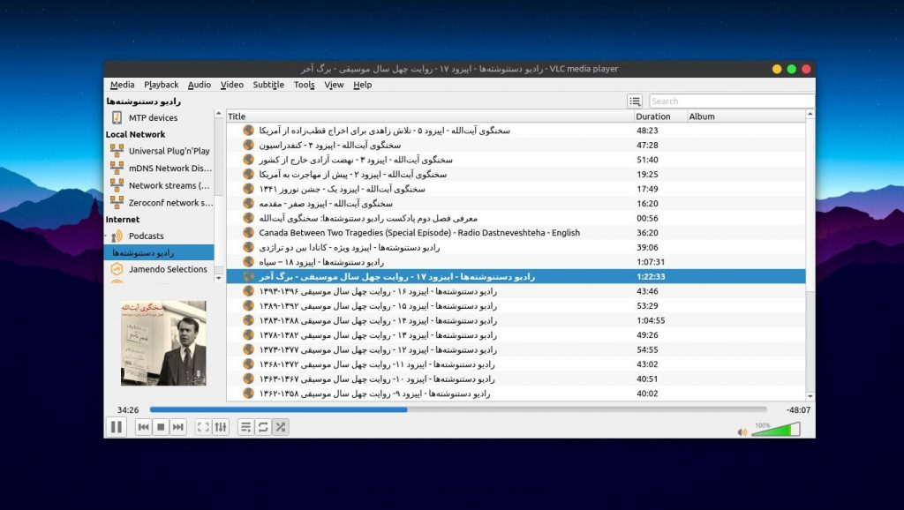
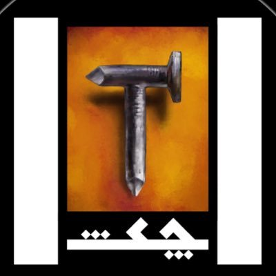
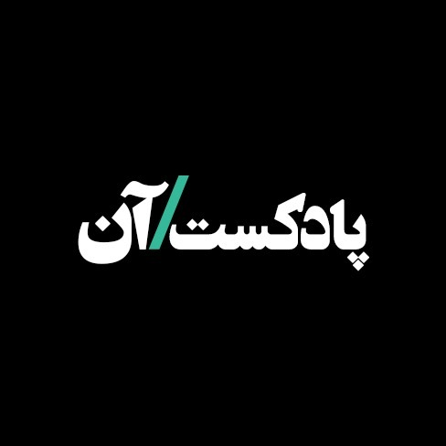
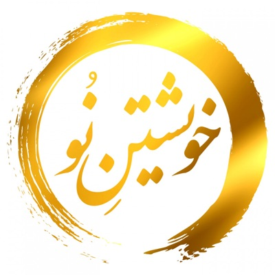
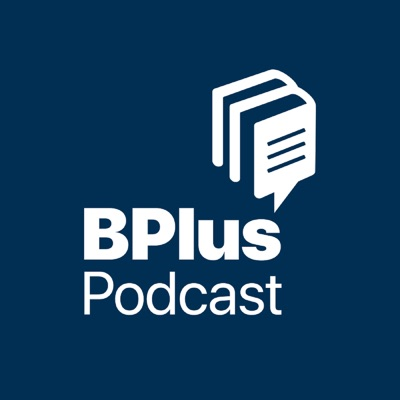

امروز [۳۰م سپتامبر (۹ مهر)](https://internationalpodcastday.com/)، روز جهانی پادکسترها هست. به مناسبت این روز زیبا میخوام درمورد یه کم درمورد پادکست بگم، اون‌هایی که دوست دارم رو معرفی کنم و خوشحال باشم از اینکه یه روز دیگه برای جشن‌گرفتن پیدا کردم توی تقویم!

## پادکست چیه؟

اگر با پادکست آشنایی ندارید پیش از این خیلی خوشحالم که این بهشت گم شده رو بهتون دارم معرفی میکنم. پادکست در واقع یک رادیوی آفلاین (غیر زنده) هست که شما می‌تونید هر وقت هرکجا خواستید بهش گوش کنید. چیزی شبیه به رادیو ولی با کلی موضوع مختلف که به صورت فایل صوتی منتشر میشه و می‌تونید از اینترنت دانلودش کنید و بشنویدش. بی اندازه موضوع مختلف هست که می‌تونید توی اتوبوس و مترو و موقع کارهای خونه یا هر جای دیگه‌ای بهش گوش کنید. کلی جای دیگه رو زندگی کنید و چیز تازه یاد بگیرید. وقتی دارید ظرف می‌شورید احتمالا نمی‌تونید کتاب بخونید یا فیلم ببینید اما با پادکست می‌تونید از مُرده ترین زمان‌های روز بیشترین لذت رو ببرید!

## چطوری پادکست گوش کنیم؟

پادکست برای اولین بار روی IPod پیداش شد و اسمش هم از همونجا میاد. ترکیبی از IPod و Cast که شده Podcast. کلی اپ پادکست یا به اصطلاح پادگیر هستند که می‌تونید جاهای مختلف نصبش کنید، من این زیر چندتا از معروف‌هاشون رو معرفی میکنم.

### اندروید:

- [CastBox](https://play.google.com/store/apps/details?id=fm.castbox.audiobook.radio.podcast)
  - کست‌باکس هر امکانی که نیاز دارید رو داره احتمالا و رابط و تجربه‌ی کاربری خیلی دلچسبی هم داره. البته تازگی ها تبلیغات داخلش زیاد شده ولی خوبیش این هست که برای زبان شما، پادکست‌های معروف و اونایی که تازه میان رو معرفی میکنه و میتونید کلی پادکست خوب پیدا کنید
- [Google Podcast](https://play.google.com/store/apps/details?id=com.google.android.apps.podcasts)
  - ساده، سریع، خوب  
    تبلیغات آزاردهنده نداره ولی ویترینش به خوبی کست‌باکس نیست به نظرم
- [AntennaPod](https://f-droid.org/en/packages/de.danoeh.antennapod/)
  - اگر دنبال یه نرم‌افزار آزاد و خوب هستید هم این یکی ناامیدتون نمیکنه. البته ممکنه برای خیلی از پادکست‌ها نیاز بشه لینک Rss Feed پادکست رو دستی کپی کنید و بهش بدید ولی خیلی دردسر خاصی نداره براتون

### لینوکس:

روی لینوکس با هر پلیری که دارید احتمالا می‌تونید پادکست گوش کنید، البته نیاز به RSS feedش دارید که جلوتر بهتون میگم، پیدا کردنش سخت نیست.

از VLC گرفته تا Clementine و Rhythmbox گرفته تا Spotify، همشون قابلیت پخش پادکست رو دارن، اما من به شخصه از وب‌اپ CastBox بیشتر استفاده میکنم.

روی ios هم که پیشفرض برنامه‌ی Apple Podcast هست اما اگر می‌خواید جایگزین هم براش پیدا میشه

### پادکست چی گوش کنیم؟

<iframe src="https://castbox.fm/app/castbox/player/id2356600?v=8.22.11&autoplay=0" frameborder="0" width="100%" height="500"></iframe>

[چنل بی:](https://channelbpodcast.com/)

چنل بی توی هر قسمت، روایت یک داستان واقعی رو به نقل از یک منبع معتبر انگلیسی زبون میگه، لحن علی بندری باعث میشه حتی داستان‌های حوصله سر بر روزمره هم لذت بخش بشن، چه برسه به داستان‌های خفن اغلب جنایی!

<iframe src="https://castbox.fm/app/castbox/player/id2380134?v=8.22.11&autoplay=0" frameborder="0" width="100%" height="500"></iframe>

چکش:

قانون و هنر! داستان‌های شیرینی از دادگاه‌هایی که درمورد هنر حکم دادن. از تاریخچه‌ی سانسور هنر در آمریکا گرفته تا غرق شدن کشتی پر از آثار هنری توی دریا. بی اندازه جذابه

<iframe src="https://castbox.fm/app/castbox/player/id1493166?v=8.22.11&autoplay=0" frameborder="0" width="100%" height="500"></iframe>

پادکست آن:

داخل هر قسمت از “آن”، خودمون رو جای یه نفر میذاریم و داستانش رو تعریف میکنیم.  
من میتونستم کوروش باشم، تو هم میتونستی کوروش باشی…

<iframe src="https://castbox.fm/app/castbox/player/id2381988?v=8.22.11&autoplay=0" frameborder="0" width="100%" height="500"></iframe>

خویشتن نو:

خویشتن نو باعث میشه خودمون رو بیشتر بشناسیم و بتونیم خودمون رو پرورش بدیم. به نظرم که واقعا نیاز هست گوش دادن به چنین پادکستی

<iframe src="https://castbox.fm/app/castbox/player/id1422128?v=8.22.11&autoplay=0" frameborder="0" width="100%" height="500"></iframe>

رادیو دست نوشته‌ها:

رادیو دست نوشته‌ها از دید من گلچینی از بهترین نوشته‌هاست که با کیفیت خیلی خوبی پادکست شدن. سریال روایت چهل سال موسیقی واقعا خوب بود.

<iframe src="https://castbox.fm/app/castbox/player/id1267619?v=8.22.11&autoplay=0" frameborder="0" width="100%" height="500"></iframe>

بی پلاس:

یه پادکست بی نظیر دیگه از علی بندری، توی هر اپیزود از این پادکست، علی بندری خلاصه‌ی یه کتاب غیر داستانی رو میگه. اگر دوست دارید قبل از خوندن یه کتاب، خلاصه‌اش رو بشنوید و یک دید کلی نسب بهش داشته باشید بهتر از این نیست.

<iframe src="https://castbox.fm/app/castbox/player/id2527697?v=8.22.11&autoplay=0" frameborder="0" width="100%" height="500"></iframe>

رادیو چهرازی:

اپیزود پاییز رادیو چهرازی به نظرم پر شنونده ترین اپیزود فارسی تاریخ هست!

> پاییز که می‌شه ما بی‌اختیار می‌ریم اتاقِ جمشید. پاییز یه‌هو می‌آد، توو یه‌روز، مثل بهار و بقیه. صپ زود بیدار می‌شی می‌بینی حیاط شده طوفان رنگ و رنگ که برپا در دیده می‌کند. ما هم مثل عوام‌الناس، مثل سیاوش قمیشی و کریستی برگ عقیده داریم پاییز دل‌گیره. شباش صدای بوف می‌آد. به جمشید می‌گیم: سر معرکه مهمون نمی‌خوای دل‌مون گرفته؟ می‌گه: بابا کجاش دل‌گیره؟ نگا نارنگیا رُ ، نگا نارنجیا رُ ، به‌زبانِ حال با انسان سخن می‌گه…
>
> جمشید – رادیو چهرازی

چهرازی توصیف شدنی نیست، باید شنید

<iframe src="https://castbox.fm/app/castbox/player/id2195745?v=8.22.11&autoplay=0" frameborder="0" width="100%" height="500"></iframe>

با صالح:

منم توی باصالح گاهی حرف میزنم از هر دری، بیشتر هم دری وری. موضوع و هدف خاصی نداره. ولی شنیدنش خوشحالم میکنه

سپاس که خوندید تا اینجا رو، خوشحال میشم شما هم پادکست‌هایی رو که گوش میکنید بهم معرفی کنید. این روز رو به تمام دوستان خوبی که پادکست‌هایی به این خوبی تولید میکنن شادباش میگم! دمتون گرم، باز دمتون گرم تر…
