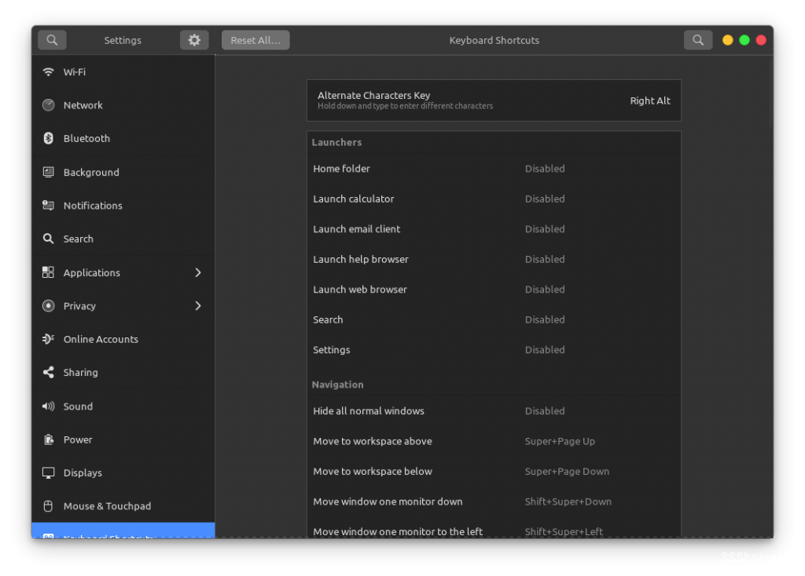

توی این نوشته می‌خوایم یکی از ابزارهای زیبای PopOS رو نصب کنیم و لذت ببریم ازش. توی نسخه‌ی 20.04 این توزیع، ابزار جذاب PopShell اضافه شده که خیلی توی مدیریت پنجره‌ها و تقسیم فضا بینشون کمک کننده هست، توی ویدیوی پایین عملکردش رو بررسی میکنیم.

<iframe src="https://www.aparat.com/video/video/embed/videohash/kEBmC/vt/frame" title="پوسته رو بشکن! گنوم شل با پنجره‌هایی رو به طلوع" allowFullScreen="true" webkitallowfullscreen="true" mozallowfullscreen="true"></iframe>

نکات قابل توجه!
---------------

*   باید گنوم 3.36 به بالا داشته باشید ( gnome-shell –version )
*   فقط روی xorg کار میکنه، اگر با wayland هستید خارج بشید و با xorg لاگین کنید
*   بعضی از شرت‌کات‌های کیبوردتون رو تغییر میده، می‌تونید از تنظیمات مثل روز اولش کنید اگر خوشتون نیومد ازش

خوب بریم برای نصب!

    ## نصب روی اوبونتو
    sudo apt install node-typescript make git
    
    cd /tmp
    git clone https://github.com/pop-os/shell
    cd shell
    ./rebuild.sh

    ## نصب روی آرچ و مانجارو
    yay -Syu gnome-shell-extension-pop-shell

خوب برای فعال کردن از system tray روی آیکونش بزنید و Tile Windows رو روشن کنید.

برای اضافه شدن تمام شرت‌کات‌های popOS هم میتونید pop-shell-shortcuts رو نصب کنید که اختیاری هست و ممکنه یه کم شرت‌کات‌های پیش فرض گنوم رو عوض کنه

    ## Ubuntu
    sudo apt install cargo rustc libgtk-3-dev
    
    ## Arch / Manjaro
    sudo pacman -S rust gtk3

    cd /tmp
    git clone https://github.com/pop-os/shell-shortcuts
    cd shell-shortcuts
    make
    sudo make install

super + arrow keys => تغییر پنجره‌ی فعال  
super + enter => حالت تنظیم  
arrow keys => جابه‌جایی پنجره  
shift + arrow keys => تغییر اندازه‌ی پنجره  
ctrl + arrow keys => جابه‌جا کردن پنجره با پنجره‌ی انتخابی  
super + O => تغییر چینش  
super + g => شناور کردن پنجره  
[و…](https://github.com/pop-os/shell)

اگر هم خواستید حذفش کنید کلا:

    rm -r ~/.local/share/gnome-shell/extensions/pop-shell@system76.com

Settings -> Keyboard Shortcuts -> Reset All…

پیروز باشید