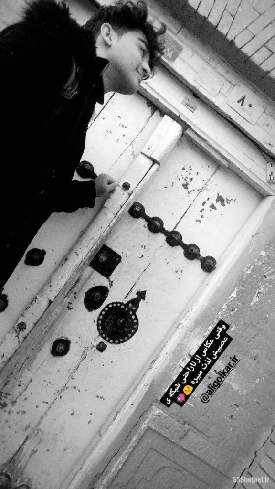
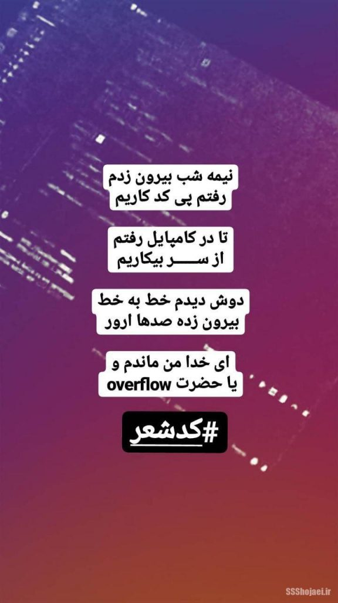
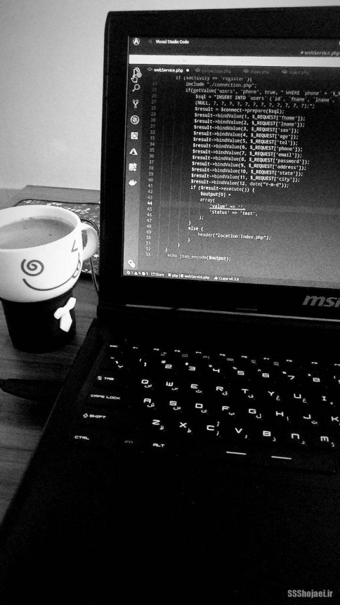
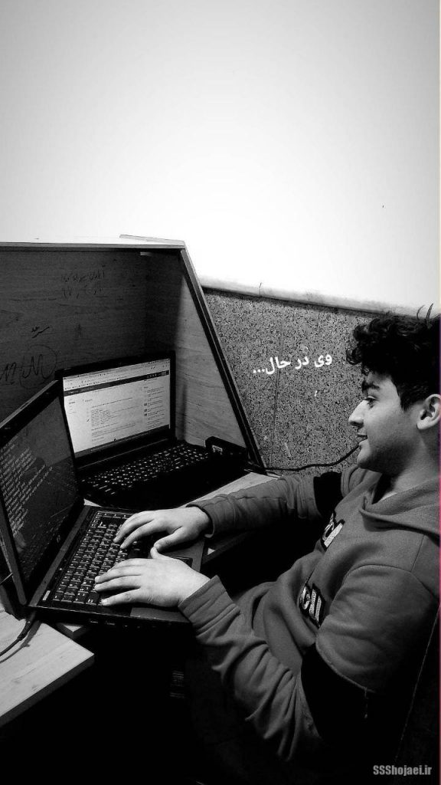

اگر صفحه‌ی اول این دفتر خاطرات رو نخونید، پیشنهاد میکنم از اونجا شروع کنید. [https://ssshojaei.ir/blog/post/software-project-management](https://ssshojaei.ir/blog/post/software-project-management)

یکی از چیزایی که خیلی مهمه، اینه که بتونید حدس بزنید کِی باید از یه جایی رفت. اولین جایی که کار می‌کردم چند سری آدم‌ها عوض شدن اما من اصلا به تغییراتی که می‌دیدم اهمیتی نمی‌دادم. تیم عکاسی از محصولات، تک تکشون عوض شدن! یه مسئول تولید محتوا داشتیم که درخواست استعفا داد، استعفاش رد شد و بعد اخراجش کردن! همه رو می‌شد در حال زیرآب اون یکی رو زدن یا چاپلوسی یه بالاتری رو کردن دید…

اگر سن کمی دارید و می‌خواید وارد یه کار بشید، به نظرم اصلا یه جای خیلی ساختار یافته و اداری رو انتخاب نکنید، چون به شکل ترسناکی با واقعیت‌های فضای کار آشنا می‌شید. بهترین کار شروع از یه تیم دورهمی دانشجویی یا یه فضای استارت‌آپی هست به نظرم. منم خیلی بعد از بقیه، به لطف یه دوست برنامه نویس دیگه که توی یه تیم دیگه بود و حرف زدن باهاش هم ممنوع بود که یه وقت کارهای تیم فاش نشه، به من بی تجربه کمک کرد بیام بیرون و اینگونه شد که بهار سال نو دیگه اونجا نبودم. هرچی فکر کردم اسم این رفیق برنامه نویسمون رو یادم نیومد ولی هم لینوکس کار بود، هم گیاه‌خوار بود، هم آدم خاصی بود. خیلی هم با هم آشنا نشدیم ولی حرف‌هاش کمک زیادی بهم کرد. ممنونم ازت ای سویشرت سیاه پوش مستر ربات استایل و طرفدار محسن نامجو، الان بیشتر قدر حرف‌هات رو میدونم.

بیرون اومدن از جای بزرگی مثل اون مرکز تجاری، توقع من رو از جای بعدی که باید کار کنم خیلی زیاد کرده بود. ساختمون و دفتر خفن، پرسنل و طبقات زیاد و…  
این شد که توی یه نمایندگی بیمه‌ی زپرتکی با حقوقی کمتر از قبل استخدام شدم! اینجا هم کلی نکته‌ی مهم دارم که بگم. حرفم این نیست که جای کوچیک استخدام شدن بد هست، ولی نبودن سلسله مراتب و این داستان‌ها هم بدی‌ها خودش رو داره به نظرم. مثلا کسی که باهات مصاحبه میکنه، کسی که مدیر پروژه‌ات هست و کلا هر سمت دیگه‌ای هست همونیه که حقوقت رو میده و این خیلی خوب نیست. روز مصاحبه با یه قیافه‌ی مظلوم از گرفتاری و بد بودن بازار و اینا گفت، گفت تو دانشجوی هستی و یه کار نیمه وقتی هست برات و اول راه هستی و این داستان‌ها

**پایین اوردن سطح کار، پایین اوردن سطح انتظار، پایین اوردن سطح شما**

اینا شرایطی هست که باعث میشه با انگیزه کاری رو کنید که اصلا بهش فکر هم نمی‌کردید! از این یکی جایی هم که کار می‌کردم راضی نبودم ولی بد هم نبود. چندتا رفیق دورت هستن که با هم کار می‌کنید، در طول روز درمورد فوتبال یا فیلم و سریال حرف می‌زنید. یکی از همکاراتون با اینکه سنش خیلی از شما بیشتر نیست، ازدواج کرده و دخترش تازه به دنیا اومده! عکس دختر خیلی خیلی کوچولوش رو گذاشته بک‌گراندش و با ذوق کار میکنه.

مطمئنم بالای ۷۰٪ جاهایی که برنامه نویس‌ها کار میکنن یه شرایط نزدیک به اینی رو داره. گاهی یه خوشی های ساده و یه صمیمیت ساده‌ای هست که باعث میشه تمام سختی ها و کم و کاستی‌های فضا کار رو از یاد ببری…

یه ویژگی دیگه‌ی منم اینه که دوست دارم با دوستام همکار باشم، چه اولین جایی که کار میکردم چه الان، همیشه دنبال این بودم که دوستان باهام کار کنن. این شد که رفیق صمیمیم هم باهام همکار شد اونجا و با هم می‌رفتیم سر کار و برگشتن هم اگر هنوز حال داشتیم کلی مسیر رو پیاده می‌رفتیم و یه چرخی توی شهر میزدیم، شایدم یه چیزی از بیرون میگرفتیم میخوردیم یا یه فیلم که روی پرده اومده بود رو میدیدم.

نمی‌تونم خیلی از کار بد بگم، حقیقش اینه که الان که فکر میکنم، با اینکه شرایط کاری اینجاها خیلی خوب نبوده ولی من همیشه خاطره‌ی خوب و حس خوبی نسبت بهشون دارم. نمی‌دونم، شاید ویژگی این سن هست که آدم توقع خاصی نداره و با اندک حقوق و ارزشی، خیلی راضی و دل خوش هست.

شرایط همینطوری می‌گذشت و خاطره‌های شیرین بی‌شماری هم ازش دارم ولی میگذرم ازش تا روزی که زدم بیرون از اونجا. این بار یه کم تجربه داشتم درمورد اینکه آدم به وقتش باید بیاد بیرون، فکر میکنم داستان این بود که من با شرایط کار پاره وقت کار رو قبول کردم ولی هر روز هفته بیشتر از تمام وقت اونجا بودم و این تاثیرش رو حقوقم واقعا چیزی نبود. احتمالا این شد که شروع کردم به بیرون اومدن از اونجا. مشخصا صاحاب کار خیلی خوشحال نشد از این داستان و با اینکه از قبل بهش گفتم ولی حقوق ماه آخرم رو نداد. هرچند با پیگیری چند ماه بعد پرداختش کرد ولی خیلی هم برام مهم نبود.

رفیقم ولی همونجا کار می‌کرد، هر کس شرایط خودش رو داره، اونم وقتی وقتش رسید زد بیرون ولی با تجربه‌ای مثل کار اول من. با دلسوزی مونده بود و دلسوزی ما ابزاری شده بود برای اون صاحاب کار عزیز که آدم‌هایی رو با حداقل شرایط و قیمت بتونه به کار بگیره… خلاصه که بگذریم، خاطرات و تجربه‌های شیرین کم نداشتم از اونجا، تلخی‌هاش گم میشه بینشون.

اون روزا چه شکلی بود؟

*   
    
    در پس از کار
    
*   
    
    در بیکاری
    
*   
    
    در کار
    
*   
    
    در دانشگاه

اینا رو گذاشتم که فضای اون روزها رو بتونم بهتر منتقل کنم. به قول اون یارو نابغهه که شرلوک با یه گلوله وسط پیشونی مبارکش کشتش، همه چیز به دونستنش هست. اگر آدم یه کلیاتی بدونه که داستان چیه و چه خبره خیلی انتخاب‌های بهتری می‌کنه. برای این قسمت هم احتمالا کافیه…

توی قسمت بعدی داستان صالح، فری‌لنسر جویای کار رو میگم براتون. ممنون که تا اینجا رو خوندید، اگر تجربه، خاطره و یا دیدگاه‌ای دارید خیلی ممنون میشم بنویسید برام.