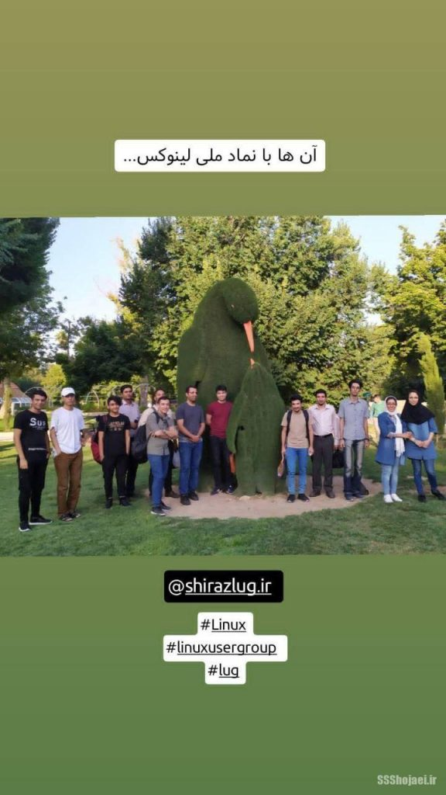
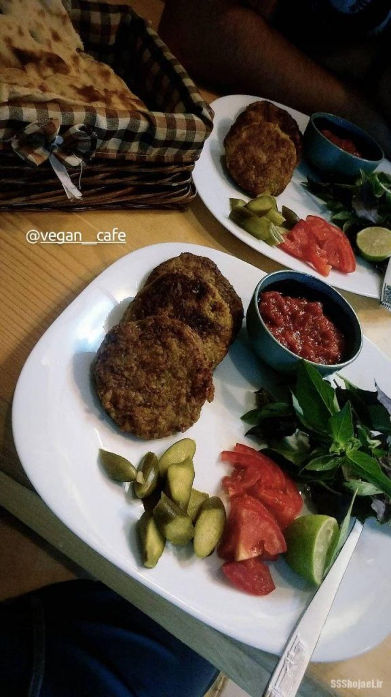
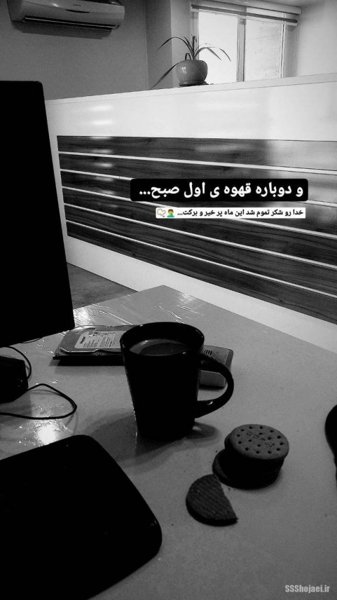

پیشنهاد میکنم اگر قسمت‌های قبلی رو نخوندید از اونا شروع کنید، این داستان ادامه‌ی اونهاست.

*   [قسمت اول](https://ssshojaei.ir/blog/post/software-project-management)
*   [قسمت دوم](https://ssshojaei.ir/blog/post/experiences-programmer)

وقتی از نمایندگی بیمه بیرون اومدم اصلا دوست نداشتم دوباره سراغ کار ثابت برم. یه مدت آزادکار (Freelancer) بودم ولی اصلا خوب پیش نمیرفت! درمورد تجربه‌های فری‌لنسر شدنم هم جداگونه کامل براتون مینویسم، اما به صورت خلاصه مشکلم توی گرفتن پول از آدم‌ها بود، اکثراشون یا ادعا داشتن خودشون برنامه نویس هستن و کار دو روز بوده و پولی نمیشه یا میگفتن باید تایید بشه و…؛ یعنی یه کار که انجامش ۳-۴ روز طول می‌کشید رو باید ۳-۴ هفته برای گرفتن پولش با آدم‌های روی اعصاب بحث میکردم.

این شد که دوباره گشتم به دنبال کار ثابت. این بار با چند جا به مراحل نهایی رسیدم و توی یکیشون یه هفته آزمایشی رو شروع کردم که استخدام هم بشم ولی به بقیه نه نگفتم. این شد که تقریبا توی آخرین روزهای هفته‌ی آزمایشی توی یه شرکت دیگه هم قرار به استخدامم شد. مونده بودم که قرارداد شرکت اول رو بعد از یه هفته آزمایشی امضا کنم یا صبر کنم، حس میکردم یه خورده سریع پیش رفته همه چیز و ممکنه اینم مثل کارهای قبلی خیلی جای خوبی نباشه. بذارید یه خورده برگردم عقب و از ویژگی‌های هر کدوم براتون بگم، از روز اولین مصاحبه.

شرکت اول:
---------

یه شرکت تقریبا بزرگ بود که روی میز و در و دیوار لوگوش حک شده بود، طبقه‌ی ۴م یه ساختمون تجاری اداری. یادمه سری اول که رفتنم داخل، برخورد کسایی که بودن صمیمی بود و خیلی استرس مصاحبه‌ی اول رو حس نکردم، شایدم بعد از چندین مصاحبه‌ای که رفته بودم توی هرجایی که دیده بودم برام عادی شده بود، دقیق نمیدونم ولی حس خوبی داشت. یه برنامه نویس هم داشتن با لحن خیلی خسته و موی و ریش بلند و بور که یکی از بهترین همکارهام شد. یه مصاحبه ی کلی هم داشت باهام درمورد کلیات و چیز تخصصی‌ای نبود زیاد. بعد هم یه قرار ملاقات با منشی اونجا تنظیم کردیم و اومدم بیرون. البته جا داره بگم از همون اول نکته‌ای رو دیدم که بعدا خیلی برام واضح تر شد، کاش اول بهش دقت کرده بودم…

همکارهای خانم وقتی رفتم داخل داشتن با هم حرف می‌زدن در تمام طول مصاحبه. اگر به این بیشتر دقت کرده بودم، موقع انتخاب میزم بینشون نمی‌نشستم. یه مقدار روی روند کد نویسیم و زندگیم و زندگی نسل‌های پس از من تاثیر منفی داشت این خاله‌زنک بازی ها. (آره میدونم خیلی حرف جنسیت زده‌ای هست ولی همینه که هست)

شرکت دوم:
---------

فضای رسمی و ساده‌ای داشتن، چندین گلدون بلند رنگ و وارنگ هم توجه آدم رو جلب می‌کرد. روی یه مبل راحتی نشستم تا جلسه‌ی قبلی تمام بشه. جای خلوتی بود و خبری از تیم برنامه نویس نبود. در واقع به جز خودم و منشی و دو نفری که باهام مصاحبه کردن کسی رو ندیدم. یه کم در طول مصاحبه کلافه شده بودم، نمیدونستم داستان چیه، با همه‌ی مصاحبه‌های دیگه فرق داشت. یکیشون درمورد نوع همکاری و اخلاقش صحبت میکرد که واقعا بی اهمیت بود برام، اون یکی هم درمورد نوع پروژه‌ها و حقوق اداره‌ی کار و پاداش صحبت میکرد که بازم مسخره بود. انتظاراتم از یه مصاحبه‌ی خوب هم براتون مینویسم. واقعا مصاحبه‌ی حرفه‌ای خیلی کم دیدم تا حالا. بگذریم، از اونجایی که یکی دو روز به آخر هفته‌ی آزمایشی بیشتر نمونده بود، وقتی داشتن حرف میزدن به این فکر می‌کردم که از اینا آبی گرم نمیشه، باید راضی باشم از جایی که هستم و قراردادم رو امضا کنم. چیزی که از جلسه فهمیدم این بود که به صورت پروژه‌ای/استخدامی کار میکنن و ازم یه لیست کامل از پروژه‌هایی که تا حالا انجام دادم میخوان. البته اینم اعصابم رو خورد میکرد چون من رزومه‌ی کاملم رو براشون فرستاده بودم و همه‌ی اینا داخلش بود ولی اصرار داشتن یه لیست آماده کنم و یک شنبه‌ی هفته‌ی آینده براشون بیارم. منم قبول کردم و اومدم بیرون.

شنبه‌ی هفته‌ی بعد قراردادم با شرکت اول رو امضا کردم و استخدام شدم، اما یک شنبه رفتم برای مصاحبه‌ی دوم اون شرکت و بازم چیز واضحی نفهمیدم. من دنبال یه عدد دقیق برای حقوق و یه شرایط مشخص برای همکاری بودم ولی اصلا توی مصاحبه‌هاشون درمورد اینا صحبت نمی‌شد. منم بعد از این مصاحبه‌ی دوم بی خیال شدم و توی شرکت اول کارم رو شروع کردم.

کار توی شرکت اول:
-----------------

اولین چیزی که خیلی توی خودم حس می‌کردم، حس خفن و حرفه‌ای بودن بی اندازه‌ای بود که برای چینش میزم داشتم. چند دستگاه روبیک، یه لیوان در دار مخصوص دمنوش، یه ماگ مخصوص هات چاکلت و کافی، چند تا کتاب از صادق هدایت و همینطور بسته‌های بیسکوئیت و قهوه‌ی آماده یه استایل حرفه‌ای تری ازم ساخته بود توی محل کار (یا دست کم خودم اینطور حس میکردم). با همکارهام هم صمیمی تر بودم که البته این رو مدیون جلسه‌ی توجیه اولیه هستم. این جلسه از جلسات رسمی شرکت نیست ولی خیلی مهمه، روالش اینطوری هست که بعضی از دخترها (شامل منشی و سایرین به جز عضو منفور)، اعضای تازه وارد رو جمع میکنن و درمورد روابط فامیلی یکی از دخترها با مدیر مجموعه بهش هشدار میدن و میگن این “آنتن” هست، همینطور درمورد ساعات حضور مدیر هم بهت اطلاعات میدن که خیلی مفیده، اصلا اگر هدفون خوبی داشته باشید از معاشرت باهاشون لذت می‌برید. اگر نکاتی که بهتون میگن رو خوب رعایت کنید و مثل من گیج نباشید که اسم‌هاشون رو اشتباه بگید، خیلی فضای دوستانه‌ای در محل کار چشم انتظارتون هست احتمالا. شوخی میکنم البته هر کدومشون توی کار خودشون متخصص بودن، از ترجمه و تولید محتوا گرفته تا طراحی، ولی به هر حال اینجایی که من کار میکردم این حس کم تر کار کردن خانم ها رو منتقل میکرد، در مورد همه جا حرفی نمیزنم من. با اون برنامه نویس دیگه (زیبا ریش و زیبا مو) هم خیلی صمیمی بودیم، روی پروژه‌ها به هم کمک میکردیم یا درمورد از شنبه باشگاه رفتن هر هفته تصمیم جدی میگرفتیم. کلا فضا هم به اندازه‌ی کافی رسمی بود که کارها خوب پیش بره، هم به اندازه‌ی کافی صمیمی بود که آدم خسته نشه زیاد. مثل اولین جایی که کار میکردم، حقوق من از همه بیشتر بود که با توجه به محرمانه بودن میزان حقوق نمیشه این ادعای کارفرما ها رو ثابت کرد. به نظرم هر کس رو میخوان استخدام کنن میگین تو بالاترین حقوق اینجا رو میگیری و بهتره درمورد حقوقت چیزی نگی که بقیه حس بدی پیدا کنن. هرچند در طول کار مشخص شد حرفش درسته و حقوق بقیه خیلی پایین تر از انتظارم بود. نمیدونم چون خانم‌ها کمتر کار میکنن حقوق کمتری میگیرن معمولا یا چون کمتر حقوق میگیرن کمتر کار میکنن ولی حس خوبی نیست، حقوقشون واقعا از چیزی که فکر میکردم کمتر بود. یکی دو بار هم برای انتشار پروژه‌ها جشن گرفتیم که تا قبل از اینجا جایی ندیده بودم، به دعوت مدیر اونجا رفتیم یه رستوران خوب و کیکی گرفته بودن که لوگو اون سایت روش بود. بد نبود جالب بود اون روزها هم، هرچند به وضوح کم پول بودن رو حس می‌کردم اواخر ماه ولی ناراحت نبودم.

*   
    
    در زندگی
    
*   
    
    در پس از کار
    
*   
    
    در کار

چند ماهی به همین روال می‌گذشت. باید اینم اضافه کنم که از ویژگی‌های دیگه‌ی من، علاقه به مهمون کردن بقیه و اصولا پول دادن موقع حساب کردن هست. مثلا چیزی که حس میکنم اینه که وقتی یکی ماشین میخره یا خونه میخره همکارهاش رو شام مهمون میکنه، باید یه مناسبت مهمی پیش بیاد ولی از وقتی که یادم میاد تا حالا، هر وقت با هر کسی بیرون بودم، من حساب کردم همه چیز رو. حس میکنم جز ویژگی‌های خوب نیست البته، چون یا طرف رو معذب میکنه و حس میکنه من خیلی تعارفی هستم یا یه حس سو اجازه‌ی سو استفاده کردنی بهش میده. ولی خوب جز چیزهایی هست که بهش فکر نمیکنم، در نهایت پول‌های من خرج میشه و هر چقدر هم پول در بیارم به آرزوهام نمیرسم، در نتیجه فکر میکنم بهترین کاری که میتونم با پولم کنم اینه که باهاش با کسایی که اطرافم هستن خوش بگذرونم، به نظرم تا جایی که به کسی حس سواستفاده نده و وظیفه‌ام نشه حساب کردن بهترین حس دنیاست. این رو گفتم که بگم این باعث شده بود تمام قهوه‌ها و بسکوئیت و… رو برای شرکت من می‌خریدم، مدیر مجموعه ام هم استقبال کرد و گفت قهوه‌هایی که میزنی جز بهترین‌‌هاست و هرچیزی برای خودت میگیری برای بچه‌ها هم بگیر، فاکتور کن حساب میکنم باهات.

**نکته‌ی مهم: تا وقتی تو حساب میکنی و دونگ طرف میشه ۵۰ تومن، ۱۰۰ تومن احتمالا میاد و حساب میکنه باهات، اما وقتی چند ماه همه جا تو کارت بکشی به جاش و دونگش سر به چند میلیون بذاره طرف عمرا حساب کنه، یادتون باشه اگر مثل من هستید، حتما توی بازه‌های کوتاه پولتون رو بگیرید چون اگر زیاد بشه انگار هیچ وقت وجود نداشته.**

اینا رو بذاریم کنار و برگردیم به فضای شرکت، آخرین پروژه‌ای که روش کار میکردیم یه مقدار درگیری داشتن با مدیر شرکت، یه پروژه از ترکیه بود که البته ایرانی بودن اونایی که میخواستنش احتمالا چون زبانش فارسی بود، انگار سر دیر شدن پروژه ناراحت بودن یا یه مشکل اساسی داشتن که می‌شد از رفتارهای مدیر و فورس شدن جدی پروژه فهمید. هم زمان با این وضعیت، مدیر شرکت دوم باهام تماس گرفت و از یه وضعیت فورس گفت که به من نیاز دارن، ازشون خبری نبود و نه رد شده بودم نه تایید. اون بررسی‌ای که میخواستن رو انجام دادم و فهمیدم مشکل کجاست، خیلی سریع بدون هیچ قراردادی بار پروژشون منتقل شد به من، واقعا نمیدونستم داستان چیه ولی حس کردم وسط داستان وایسادم. پروژه‌ای که باید انجام می‌شده و تحویل داده شده ولی کلی ایراد اساسی داره و اصلا کار نمیکنه. این شده که شکایت شده و قراره کار به دادگاه کشیده بشه و منی که اصلا استخدام هم نشدم یه هوو به عنوان سوپر هیرو قراره پروژه رو نجات بدم.

مونده بودم چی کار کنم، واقعا این مرموز بودن شرکت دومی هم آدم رو وسوسه میکرد برای همکاری، نمیدونم شاید من این مرض رو داشتم ولی میخواستم ببینم اصلا داستان اینجا چیه، این شد که کارشون رو پیش بردم و اون داستان یه جوری حل و فصل شد. کم کم بیشتر باهاشون آشنا شدم و یواش یواش بیشتر فهمیدم جلسه‌های مصاحبه چرا یه جور عجیبی بوده.

این شرکت دومی یه جور هلدینگ بود که توی همه جور بیزینسی، از پیمان‌کاری شرکت نفت و گاز تا واردات و صادرات زعفرون رو انجام میداد. اون کسی که توی جلسه‌ی مصاحبه از اخلاقش میگفت مدیر این مجموعه بود، اون یکی دیگه که درمورد حقوق اداره‌ی کار و پاداش توضیح میداد، مدیر بخش فنی بود که آدم‌هایی رو با حقوق اداره‌ی کار استخدام می‌کرد و پروژه‌ها رو بهشون میسپرد، بعد از تحویل پروژه بهشون پاداش میداد که درآمد اصلیشون اون می‌شد انگار نه حقوق، حقوق برای این بود که مثلا اگر پروژه‌ای هم در کار نباشه بدونی که یه حقوقی داری و به جز اینجا از جایی پروژه نگیری.

احتمالا همین شرایط باعث شده بود خیلی از پروژه‌ها در طول زمان به مشکل بخورن و تست نشده تحویل داده بشن، اون مدیر مجموعه هم کارش خرید و فروش بوده و پروژه رو فروخته و حالا مشکلاتش نمایان شده. در نهایتا این مدیر بخش فنی میره و پروژه‌ها معلق میشه. البته باید بگم که تمام اینا تلاش‌های ذهن من برای ساختن یه داستان از اتفاقاتی هست که افتاده، ممکنه درست باشه یا اصلا نزدیک به واقعیت هم نباشه.

پس این شد که من توی شرکت اول مشغول بودم کماکان و کنار همکاری با شرکت دوم، کم کم داشتم آشنا می‌شدم که چه خبره. یکی دو تا جلسه هم به عنوان مسئول بخش فنی با مدیر مجموعه رفتم که بازم با شرکت‌های دیگه فرق داشت، چندتا از مدیرهای ارشد PSP های کشور بودن داخلش که فکر نکنم بتونم جزئیاتی بگم ولی صحبت‌ها در مورد نمایندگی اختصاصی پخش و پشتیبانی دستگاه پوزهای فارس و بوشهر و چندتا استان دیگه بود، واقعا فضای بسیار متفاوتی بود برای من.

درمورد شرکت اول یه کم فضا در هم شده بود، حقوق ها یه کم این ور و اون ور می‌شد و مشخص بود یه فشار مالی داره میاد به مجموعه. این شد که با تجربه‌های قبلیم یه مقایسه کردم و تصمیم گرفتم بیام بیرون…

با مدیر اونجا یه روز آروم پیدا کردم و صحبت کردم، از قراردادم خیلی مونده بود و چند ده میلیون سفته هم داشتم دستش، این شد که گفتم کار کردن من رو از زندگی میندازه و باید دانشگاهم رو تموم کنم، مجموعه‌ی بسیار خوبی برای کار کردن هستید و خیلی راضی هستم و…  
اونم راضی شد و گفت میتونی هفته‌ی دیگه بری، آخر هفته‌ی بعد برای رفتن باهاش صحبت کردم، گفت مثلا ۲ شنبه بیا برای تسویه. منم گفتم باشه و از بچه‌ها خداحافظی کردم. یکی از دخترها هم ماگ من رو برداشته بود اون روز (مثل روزهای دیگه البته)، این شد که ماگ من به یادگار موند دستش و زدم بیرون از اونجا.

۲ شنبه که رفتم خود مدیر مجموعه نبود، منشی یه متن بهم داد که باید امضا میکردم و سفته‌ام رو پس میگرفتم، ازم پرسید حقوقت رو تسویه کرده؟ گفتم نه، گفت خوب اینم زیرش بنویس، به آخر متن اضافه کردم که سفته‌ام رو گرفته‌ام اما حقوقم رو نه، علاوه بر حقوقم کلی چیزایی که برای شرکت خریده بودم هم بود که چیزی درموردشون ننوشتم و اومدم بیرون. البته اینم بگم که برعکس همیشه که با تیشرت میرفتم سر کار، اون روز با کت و شلوار و استایل مدیرعاملی رفتم که حس کنن دارم میرم یه جای خفن تر ولی نبودن مدیر (احتمالا برنامه ریزی شده) مانع از این حرکتم شد.

چند ماه بعد هم شنیدم که همه استعفا دادن و رفتن، به منم پیام دادن برای گرفتن حقوق بریم شکایت کنیم اداره ی کار ازش، انگار بعد از من چند ماه حقوق بچه‌ها رو نداده بود، نمیدونم نتیجه چی شد ولی من پیگیرش نشدم، شاید هم اینکه حوصله‌اش رو نداشتم، هم اینکه درمورد وسط قرارداد بیرون اومدنم خودم رو گناه‌کار میدونستم یه کم. در هر صورت فکر میکنم یکی از به موقع ترین بیرون اومدن‌هایی بود که داشتم.

اینکه بعد از بیرون اومدنم از اونجا چه اتفاقی افتاد و داستانم با شرکت دوم چطوری پیش رفت رو توی قسمت بعدی براتون میگم.

ممنون از اینکه داستان رو دنبال و حمایت میکنید، دیدگاه‌هاتون برام خیلی دلگرم کننده هست، حتما باهام به اشتراک بذارید دیدگاهتون رو ❤️
