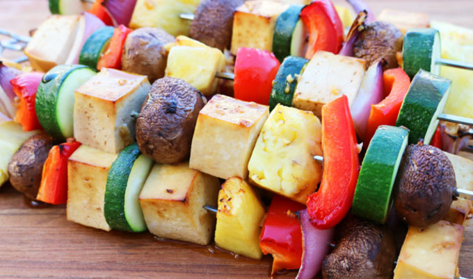

توی برنامه‌نویسی معمولا از فاصله (" ") برای جدا کردن مفهومی کلمات استفاده نمیشه، زبان‌های برنامه‌نویسی برداشت دیگه‌ای دارن از این کاراکتر. بنابراین به جای فاصله

```js
const user login count = 3 //Error
```

باید با روش دیگه‌ای کلمه‌ها رو از هم جدا کنیم. بریم و با هم با مرسوم‌ترین این استانداردها آشنا بشیم.

## شتری نویسی - Camel Case:


این روش از کوهان شترها الهام گرفته، دست کم برای نام‌گذاری...

توی camelCase، کلمات رو با حروف اول بزرگ از هم جدا میکنیم، بعد از اولین کلمه. به این صورت:

معمولی: `user login count`

کَمِل‌کیس: `userLoginCount`

این روش، مرسوم ترین روش هست و معمولا به عنوان یک قانون نوشته نشده، همه ازش استفاده میکنیم توی زبان‌های برنامه‌نویسی مختلف

## پاسکال - Pascal Case:

این روش فاصله‌ها رو حذف میکنه و حرف اول تمام کلمات (حتی اولین کلمه) رو بزرگ میکنه.

معمولی: `user login count`

پاسکال: `UserLoginCount`

در بسیاری از زبان‌ها از این روش برای تعریف کلاس‌ها استفاده میشه.

## مار گونه - Snake Case:

"به احترام رفیقم که فوبیای مار داره، از نمایش تصویر این گونه‌ی زیبا گذر می‌کنیم"

این روش فاصله‌ها رو با underline "_" جایگزین میکنه و در حالت معمولی تمام حروف رو کوچیک میکنه ، در حال All Gaps همه‌ی حروف رو بزرگ میکنه

معمولی: `user login count`

مار گونه: `user_login_count`

مار گونه (All Gaps): `USER_LOGIN_COUNT‍

از این روش هم توی زبان‌های زیادی استفاده میشه، از حالت Snake All Gaps معمولا برای تعریف ثابت‌ها استفاده میشه و از حالت معمولی هم بیشتر توی تعریف فیلد‌های دیتابیس استفاده میشه.

## کبابی - Kebab Case:



توی Kebab Case فاصله ها رو به dash ("-") یا خط فاصله جایگزین میکنیم

معمولی: `user login count`

کبابی: `user-login-count`

این روش بیشتر توی نوشتن URL ها استفاده میشه. مثل لینک پایین.

https://roxaleh.ir/blog/useful-extensions-for-gnome-40

## کدوم روش بهتره؟

همشون/هیچ‌کدوم. همونطور که با هم دیدیم، هر کدوم برای جاهای خاصی کاربرد دارن و باید از هرکدوم توی جای درستش استفاده کنیم.


و در انتها بگم که خودم از همشون استفاده میکردم توی جای خودش اما اسم‌هاشون رو نمیدونستم. با دیدن یه یوتیل توی پروژه‌ی تازه‌ای که روش کار میکنم به اسم convertToKebabCase کنجکاو شدم که کباب کیس چیست دیگر و گفتم که این رو با شما هم درمیون بذارم.
منبع این پست: 

https://betterprogramming.pub/string-case-styles-camel-pascal-snake-and-kebab-case-981407998841
